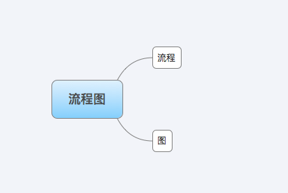
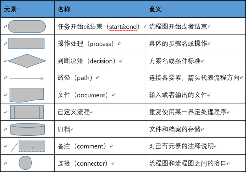
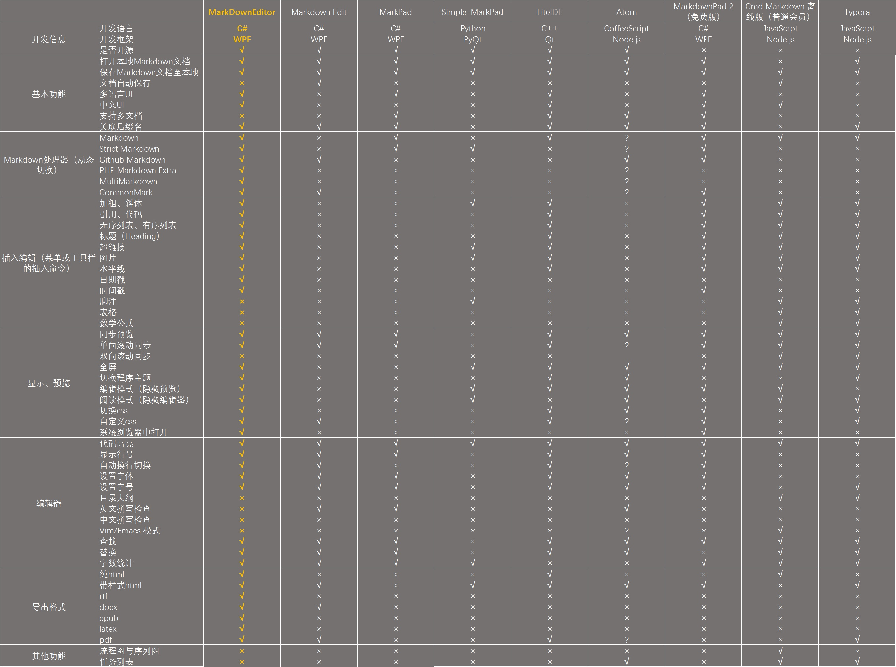
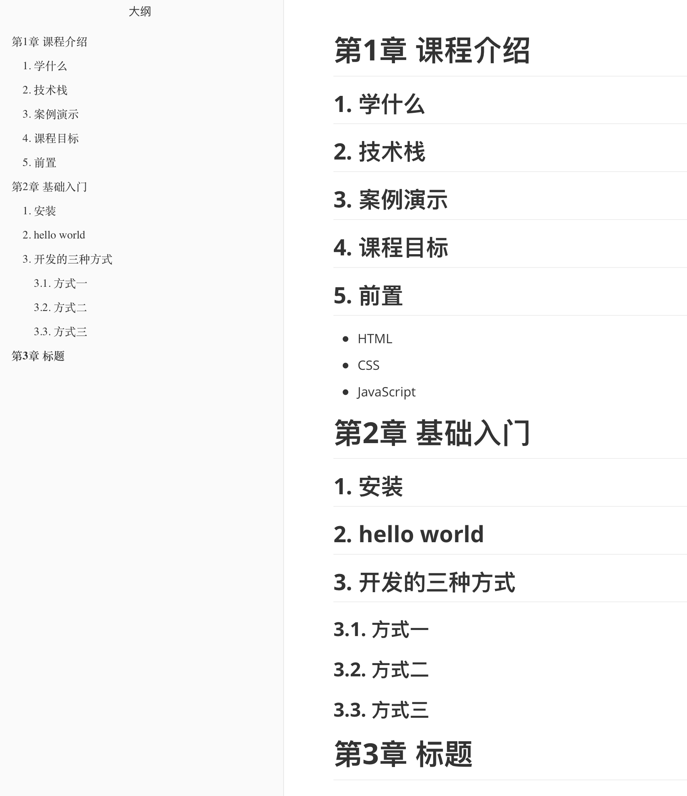
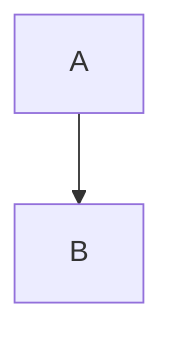
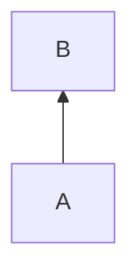
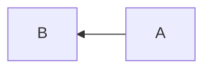
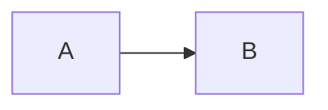
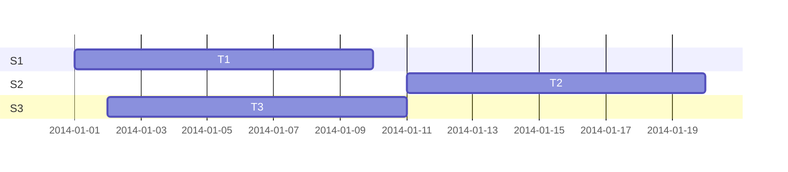
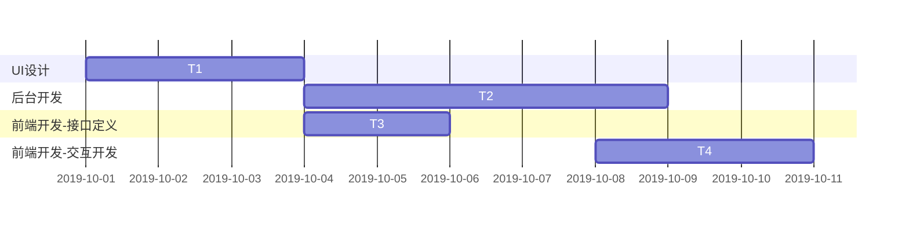

# 项目管理——文档管理

## 课程介绍

在前端工程师的世界里，需要与多个角色的人员打交道。

而文档作为前端工程师不可跨越的坎，必须是一项熟练技能。写好技术文档，不仅需要有很强的逻辑思维能力，而且还需要有好的工具与格式（工欲善其事，必先利其器）。那么，前端的技术文档有哪几类呢？

- 需求文档
- 接口文档
- 项目文档（描述性、功能使用性）
- 总结类型


**本课程的主要内容：**

- 项目文档之需求文档（书写格式）
- 需求文档的相关工具（原型图、流程图工具、文档管理工具）
- 文档管理之Markdown进阶（表格使用，包括流程图，甘特图，时序图）
- 文档管理平台MinDoc


**本课程的学习路径：**

- 需求文档的主要内容
- 需求文档格式
- 原型图，流程图介绍
- 需求文档工具及使用
- 学习描述文档的格式
- 了解描述文档书写注意事项
- 掌握功能说明、开发文档的书写方法
- 常见工具Typora使用及常见配置（主题）
- Markdown语法：流程图，甘特图，时序图


**本课程的学习目标：**

- 了解需求文档的基本内容
- 学会书写需求文档的基本格式
- 学会基础的需求文档的工具（流程图、原型图）
- 学会搭建MinDoc文档管理工具


**本课程的学习准备：**

Markdown编辑器Typora下载

Linux服务器，或者虚拟机（Centos 7.x），安装Docker服务

参见：https://www.daocloud.io/mirror


## 需求文档

### 如何书写需求文档

**BRD** 商业需求文档 **B**usiness **R**equirement **D**ocument
**MRD** 市场需求文档 **M**arket **R**equirement **D**ocument
**PRD** 产品需求文档 **P**roduct **R**equirement **D**ocument


#### 商业需求文档（BRD）

**BRD是针对谁看的呢？一般都是针对老版或CEO或者项目总负责人，那么他们需要了解的是什么呢？**

**1. 要做什么样的产品；**
这就包含了项目定义，描述项目并且让老版感觉到产品的竞争优势；

**2. 需要什么样的资源**
要什么资源就必须知道产品的市场位置，通过多少人、多长时间、多少Money、多少关系等等能够实现这样的市场位置，并且还需要有利且有力的商业说明，需要有一定的高度！

**3.最终做成什么样；**

要怎么做或者说怎么安排，老板们很少关心，更多的是关心产品的结果展示及盈利，这个产品能带来什么样的收入情况；

最终BRD就浓缩为 商业模式、盈利模式、资源投入、市场优势等；哦！对了！还有重要的一点就是“战略壁垒”，为什么呢？这一点主要是针对被Copy和产品包括来做的，这一点或许决定着整个产品的成败，但是如果说有些公司有特殊的资源那就另一码事！


**一般格式：**

- 产品介绍（用一句话来清晰的定义你的产品）
- 产品的商业模式（如果你的项目值得做，那项目如何赚钱。可能是广告、可能是会员等级、可能是网上商城、可能是通过游戏...）
- 产品市场分析（宏观的行业趋势、微观市场分析等等）
- 竞争对手分析（竞争对手有那些，我们该如何和他们竞争）
- 团队（我做这样一件事情需要那些开发人员，需要那些产品人员，需要那些设计人员、需要那些运营人员，这些人员的人力成本是多少，都需要列出来）
- 产品路线图（产品路线图也叫做roadmap，版本规划是啥样的，每一个版本的大概功能模块有哪些，每个版本的时间安排是啥样的，当然不用那么细，对技术人员来说有个大概的了解就行）
- 财务计划（收入的来源和渠道有那些，如何才能达到收支平衡，产品的收益增长率是怎样的）


#### 市场需求文档（MRD）

**MRD是针对谁看的呢？一般都是商务、运营、市场人员，那么他们需要了解的是什么呢？整个文档对于他们的重要性？**

**1. 我们要找什么样的客户，进行资源合作**
一般公司资源合作的都是商务和市场人员，或者加上运营人员，那么他们是资源拓展者，对于产品保驾护航，正如船要出海，就必须有在海里或者有水的地方，海的大小决定了船的大小，所以他们就是船的载体，不可能产品开发完介入吧？要是真是这样，那就当这里我没有说！商务、市场及运营人员在产品之前必须对于产品进行资源拓展，且快速评估产品的实现情况，MRD就是给他们一个清楚的方向，我该找什么样的客户，在这里或许有的朋友就问题了?你没有产品这些人员不可能空说吧，看到客户该怎们沟通，这一块就是项目与运营之间一种Demo沟通了，在这里暂时不说了！

**2. 找到客户后，我们该怎么和他们说**
上面说了MRD指引着商务、市场和运营往前走，那么找到客户该怎么和他们说呢？除了文档描述一个清晰的蓝图，或者说从红海中挖出新的路子，这里边就是MRD中的业务模式了，通过业务模式，可以看到清晰的产品，且客户可以看到他们在中间的位置，甚至说他们怎么赢利；一般给客户看到的都是PPT+Demo的方式，这样对于客户更直观更易于理解，所以MRD的文档就是给团队和客户一个说明；

**3. 产品针对什么样的用户群体**
商务是资源拓展的关键、市场是产品保障的关键、则运营就是产品的推手，那么市场和运营就需要了解产品是针对什么用户群体的，毕竟最终的是使用人群是用户，MRD基本需要明确产品的用户人群，这样市场才能更好的进行分析，通过分析这个人群，给运营提供很好的参考资料，这样运营在推广这部分人群的时候也能够制定出很好的方案，资源优化及减少资源消耗，这就是MRD对于商务、市场、运营的关键作用；

最终MRD就浓缩为产品模式、业务模式、运营模式、市场模式等，明确客户及市场方向！


**一般格式：**

- 目标市场分析（包含目标市场、市场规模、市场特征、发展趋势等）
- 目标用户分析（用户分析、用户画像、使用场景、用户动机总结）
- 竞品分析（竞品分析对象、竞品商业模式、竞品目标用户、竞品运营/推广/营销策略、技术分析、竞品市场份额）
- 产品需求概况（产品定位、产品核心目标、产品结构、产品路线图、产品功能性需求、非功能型需求）


#### 产品需求文档（PRD）

**PRD是针对谁看的呢？一般都是项目组、开发组、测试组、策划组、体验组人员；**

**1. 产品具体是什么样的呢？**
对于与产品相关的人员，就必须有一个清楚的产品概念，这个产品到底是干嘛的？插句话说，公司对于人员有一个硬管理文化，这就是公司的管理制度，而产品则是公司的软文化，让每一个参与产品的人都有一个“产品梦”，变成一群有产品信仰的人，无形中就会增加团队的战斗力。话扯回来了！要了解到底是什么产品，那就需要详细而简单的进行说明，但是这个只能是描述，还需要有与策划、开发、测试等另一种沟通语言，那就是UI、UE、原型图、流程图等，这样方便策划及开发人员的工作进展!

**2. 我们该怎么实现呢？**
该怎么实现，那就是规划了，包括时间、人力、资源等，什么时间完成什么事了！在前进的路上设立一些里程碑！这就对于产品经理来说就是一个挑战了？为什么呢？因为产品经理与商务、市场、运营沟通的方式和开发人员方式不一样，有什么不一样呢？商务、市场、运营更多的是发散型思维，而开发则更多是紧密型思维，对于开发人员的沟通则不能用“基本”“差不多”“还好”等这样的词来进行沟通，否则开发人员会开始发散，如果发散的和你一致的话，你就烧高香吧，如果不一致，对于程序来说推导再来，就不是那么容易的了！甚至出现了大量的BUG，有时候过多的BUG会让一个产品死掉！
所以就需要有详细的功能说明，细化到什么程度了，用YN原则来说明，VISIO是甚好的工具，不能出现模凌两可的语句，甚至需要通过语句进行if else描述，对了还有default，这个很关键，当程序运行正确了那固然好，如果程序出现BUG，则你不能让程序没有出口吧，那就是default了，给程序的BUG找一个合理的理由！

**3. 什么样的产品才能投入到市场？**
产品开发人员更多的是站在产品角度思考问题，以实现产品而完成产品，那么产品最终开发完后，是不是能够满足运营需求呢？这时候产品经理就需要进行产品审核！怎么审核呢？简单的依据于之前的详细功能说明来进行需求审核，但是需求审核只是测试走完了第一步，第二步就是黑盒、白盒、甚至灰盒测试，走完第二部还有第三步，那就是需求优化，怎么优化呢，依据于市场人员及运营人员提供的用户数据来进行，再让产品设计人员进行UI优化，立足站在用户的角度；第三步完成了，就是最终的步骤了，体验师就起了关键性的作用，AB原则就出来了，将产品上线，体验师们就开始采集用户信息进行分析了，这个阶段对于产品的整个战略规划很关键，因为用户对于产品的第一感觉非常重要，如果是互联网产品则你可以换个网站，反正用户没法删除你的网站，但是对于移动互联网的产品APP来说，就是一个挑战了，看着不顺眼就直接给删除了，你说你的产品还有第二次机会进入用户的手机吗？除非你搞特殊！

PRD最终浓缩下就是产品界面、产品流程、功能需求、测试需求、体验需求等，保证产品有效率有节奏的进行！关系到整个产品的发展方向！


**一般格式：**

- 文档产品名称
- 版本历史
- 目录
- 文档介绍（主要介绍文档的目的、文档面向的主要用户，读者对象、参考文献、术语与缩写解释等）
- 产品概述（从大的方向，讲讲项目的相关背景，有什么目标、有没有竞品对象？阶段性计划是什么，传递做这个需求的目的是什么？要达到什么样的目标？让项目开发人员对你的项目背景有了解，程序员知道的越多，做起项目来越有方向性。）
- 产品需求（也就是功能清单，feature list）
- 产品结构图（这个也称作脑图，用xmind或者mindmanger来画）
- 全局功能说明（UI设计会出一个UI设计规范，当然我们做产品的也会对产品中经常用到的一些公共情况做一些说明，可以作为一个全局说明）
- 产品详细功能说明（一般用用例表来进行说明，以登录注册模块为例，有流程图的话，先把任务流程图画出来，然后是用例表，用例表包含简要说明、行为者、前置条件、后置条件、功能说明、备注。功能说明一定要排版简洁、层次清晰，功能说明无遗漏）
- 非功能性需求（非功能性需求主要包含性能需求、适配需求、环境需求、统计需求、预留接口等）
- 相关文档（如果一个项目分解成多个团队，多个需求文档协同合作，比如数据埋点文档）
- 上线需求（设计什么时候OK、什么时候测试，具体的上线时间，具体一些特殊的流程需求等）


#### 书写建议

根据上面的知识点，我们给大家一些书写建议：

- 使用同类型的文档进行修改
- 区分应用场景
- 列大纲
- 使用写作模板
- 使用在线类的工具进行协同
- 进行版本控制


### 原型设计

#### 原型设计的要点

1. **成本控制** — 从细节开始减少用户的操作及学习成本，使用户快速上手和识别产品特性

   在实际的产品使用中，用户并不笨，只是懒，远比我们相信中的还要懒。当一个产品是刚需的时候，我们就能够吸引用户投入更多时间去理解产品和使用产品，但是在互联网行业，产品的同质化是很严重的，没有什么产品是不可取代的，所以在产品设计中，我们要尽量让用户在不同场景情况下以最懒的方式使用产品。

   因为用户懒，没有时间深思熟虑的了解我们的产品，所以在产品设计中，要以核心功能为中心，尽量减少不必要的功能和操作步骤，以最效率和便捷的方式让用户达到最终使用目的。

   例如：移动 APP 产品要了解用户的使用情境(碎片化的时间，随时会被打断)，尽量不要增加学习成本(操作学习、界面学习)，因为用户的时候是碎片化的，他们没有太多时间学习，特别是多手式操作是有学习和记忆的成本的。

2. **减少界面** — 尽量减少界面间的交互，避免新页面切断了用户使用的流畅感

   对于移动 APP 产品，如果在一个页面里能够交互完成的内容，尽量减少页面的切换，当然前提是考虑了系统的负载。

   例如：搜索功能，触击搜索按钮后平滑展开输入框，同时展开虚拟键盘。

   例如：选择功能，触击后展开选择器，在选择器里连续触击某条选项两次完成选择，或者选中某条选项后再触击完成。

   如上两条简单的示例，都是可以在当前界面内完成的。在当前界面平缓交互出来的元素给用户在体验上更加流畅，同时也让用户觉得只是在原有界面上载入了新元素，用户感观上只需要接受新的元素。而新界面突然切断用户使用的流畅感，也就是说用户的思维需要进行切换，需要重新接受并认识新的页面，就像进入了另一间屋子。

3. **简洁元素** — 减少视觉元素的堆叠，提高交互元素的辨识，合理隐喻交互元素

   产品设计中的视觉体验也很重要，如今简洁风格是一种设计趋势，复杂的元素会增加用户的识别成本，用户需要接受和学习的元素过多容易造成审美和使用的疲劳，特别是元素没有统一的连贯性，所以界面越简洁越好，元素越少越好，可大大减少视觉上的信息接受量。

   比如移动 APP 产品中使用图形隐喻时，在移动产品中，由于界面大小的因素，我们经常会遇到用图标做功能按钮，因此按钮的图标就需要充分考虑用户的体验认知。例如普遍的圈型箭头是刷新、心型是关注、星型是收藏、齿轮是设置 等等。我们在采用图形隐喻功能的时候，应当考虑用户的认知，避免用户学习和识别的成本。

4. **明确结构** — 合理划分界面的逻辑结构，按照不同的内容与功能进行划分，突出结构主次

   合理划分和突出界面的层次，可以减少用户的负担，提升操作效率。特别是移动 APP 产品，由于移动设备的屏幕空间有限，简洁的层次结构和明确的界面区域，可以大大提升用户的操作体验。

   这上面的两条都是比较偏向于视觉体验，主要是通过**布局和色调**来增强用户体验，从而影响用户的操作行为，并且清晰明了的界面结构和内容，可以高效的告诉用户在那里，退路在那里，能够去那里。


#### 常见的原型设计工具

- Axure（win/mac）
- Edraw（mac）
- 墨刀（在线）


### 流程图设计

很多人拿到需求就火急火燎的开始画原型，然后画着画着觉得有些地方没有考虑到，又回头去改，如果在画原型之前，你能将自己的业务流程想好，用户的操作流程想好，页面跳转想清楚，你就能少做很多无用功，达到事半功倍的效果。

#### 什么是流程图



流程是一系列的逻辑关系（包含因果关系、时间先后、必要条件、输入输出）。

产品经理做需求前一定要先把这些逻辑关系理清楚，如果非要用一句话概括的话“流程就是在特定的情境下满足用户特定需要的总结”。

图就是将你头脑中的逻辑关系以图形化的形式呈现出来，具有图形化、可视化的特点，因为是图，你可以像你的版本迭代一样，当你的逻辑需要修改的时候拿出来迭代一下，同时因为有图，你还可以更好的给项目成员进行宣讲。


**画流程图的意义（why）**

**1、帮助梳理逻辑**

我们每个人想一个逻辑的时候，不一定能把这个逻辑的细枝末节都想到，如果我们贸然的画原型就有可能做许多无用功，这个时候画流程图可以帮助我们梳理清楚我们的逻辑。建议刚开始梳理逻辑的时候可以在纸上画画这种流程图，因为这样的好处是你可以快速的把你脑中的逻辑呈现在纸上，修改起来也方便，当你画好以后然后再用专业的工具画出来保存。

**2、便于宣讲和传播**

产品经理需要开评审会和写PRD文档的，这个时候如果你有一张清晰的流程图，不仅便于你讲解，也便于技术理解，同时把你的流程图插入PRD文档中也方便传播，当技术忘记流程的时候，查看一下文档里的流程就知道流程是啥样了，不用反复来找你确认。

**3、优化迭代**

对于拿到一个逻辑，我们不一定能考虑的那么周全，这个时候有一个清晰的流程图也方便做记录以及修改。

同时每个版本迭代的流程图可能会有相应的变化，通过对每个版本流程图的对比分析，可以知道流程优化在什么地方，产品优化了什么地方。


**如何画流程图？（how）**

流程图是符号化的图形语言，有自己的规范，菱形代表判断，距形代表具体的操作行为、开始和结束用圆角表示...



遵守这些行业规范不仅让别人觉得你专业，同时也有利于看的人理解，就好像阿拉伯数字全世界都能看懂一样。


流程图有几类：

- 业务流程图
- 任务流程图
- 页面流程图


#### 常见的流程图设计工具

- Visio（win）
- Axure
- OmniGraffle（mac）
- processOn（在线）


### 常见文档管理工具MinDoc

常见的文档管理平台

- mindoc/showdoc
- DOClever/Easymok/YApi
- Swagger/jsapi/xiaoyaoji


MinDoc 是一款针对IT团队开发的简单好用的文档管理系统。

MinDoc 的前身是 SmartWiki 文档系统。SmartWiki 是基于 PHP 框架 laravel 开发的一款文档管理系统。因 PHP 的部署对普通用户来说太复杂，所以改用 Golang 开发。可以方便用户部署和实用。

开发缘起是公司IT部门需要一款简单实用的项目接口文档管理和分享的系统。其功能和界面源于 kancloud 。

可以用来储存日常接口文档，数据库字典，手册说明等文档。内置项目管理，用户管理，权限管理等功能，能够满足大部分中小团队的文档管理需求。

**安装与使用**

如果你的服务器上没有安装golang程序请手动设置一个环境变量如下：键名为 ZONEINFO，值为MinDoc跟目录下的/lib/time/zoneinfo.zip 。

**Windows 教程:** https://www.iminho.me/wiki/docs/mindoc/mindoc-windows.md

**Linux 教程:**  https://www.iminho.me/wiki/docs/mindoc/mindoc-linux.md

**MinDoc 功能配置教程**  https://www.iminho.me/wiki/docs/mindoc/config.md

MinDoc 使用MySQL储存数据，且编码必须是`utf8mb4_general_ci`。请在安装前，把数据库配置填充到项目目录下的 conf/app.conf 中。

如果conf目录下不存在 app.conf 请重命名 app.conf.example 为 app.conf。

如果 MinDoc 根目录下存在 install.lock 文件表示已经初始化过数据库，想要重新初始化数据库，只需要删除该文件重新启动程序即可。

**默认程序会自动创建表，同时初始化一个超级管理员用户：admin 密码：123456 。请登录后重新设置密码。**


使用docker安装：

如果是Docker用户，可参考项目内置的Dockerfile文件编译镜像。

在启动镜像时需要提供如下的环境变量：

```ini
MYSQL_PORT_3306_TCP_ADDR    MySQL地址
MYSQL_PORT_3306_TCP_PORT    MySQL端口号
MYSQL_INSTANCE_NAME         MySQL数据库名称
MYSQL_USERNAME              MySQL账号
MYSQL_PASSWORD              MySQL密码
HTTP_PORT                   程序监听的端口号
```

docker run命令：

```bash
docker run -p 8181:8181 -e MYSQL_PORT_3306_TCP_ADDR=127.0.0.1 -e MYSQL_PORT_3306_TCP_PORT=3306 -e MYSQL_INSTANCE_NAME=mindoc_db -e MYSQL_USERNAME=root -e MYSQL_PASSWORD=123456 -e httpport=8181 -d daocloud.io/lifei6671/mindoc:latest
```


docker-compose命令：

```yaml
version: '3'
services:
  mindoc:
    image: liweiwh/mindoc
    container_name: 'mindoc'
    restart: always
    ports:
      - 10000:8181
    volumes:
      - /var/www/mindoc/database:/mindoc/database
      - /var/www/mindoc/uploads:/mindoc/uploads
    environment:
      - MYSQL_PORT_3306_TCP_ADDR=mysql
      - MYSQL_PORT_3306_TCP_PORT=3306
      - MYSQL_INSTANCE_NAME=mindoc
      - MYSQL_USERNAME=itcastor
      - MYSQL_PASSWORD=itcast_2019
      - httpport=8181
    depends_on:
      - mysql
    networks:
      - mindoc

  mysql:
    image: mysql:5.7
    container_name: 'mindoc-db'
    restart: always
    volumes:
      - /my/own/datadir:/var/lib/mysql
    environment:
      - MYSQL_ROOT_PASSWORD=123456
      - MYSQL_DATABASE=mindoc
      - MYSQL_USER=mindoc_user
      - MYSQL_PASSWORD=mindoc_password
    command:
      [
        'mysqld',
        '--character-set-server=utf8',
        '--collation-server=utf8_unicode_ci',
      ]
    networks:
      - mindoc

networks:
  mindoc:
    driver: bridge
```


## Markdown

常见的Markdown编辑器：

- MarkwondPad
- MacDown
- MWeb
- Typora（推荐）
- ...




### Markdown的基础语法

- 标题

  主要的作用就是用于形成比较有层次的大纲，便于组织内容。

  示例：

  

  

  代码：

  ```
  # 第1章 课程介绍
  
  ## 学什么
  
  ## 技术栈
  
  ## 案例演示
  
  ## 课程目标
  
  ## 前置
  
  - HTML
  - CSS
  - JavaScript
  
  # 第2章 基础入门
  
  ## 安装
  
  ## hello world
  
  ## 开发的三种方式
  
  ### 方式一
  
  ### 方式二
  
  ### 方式三
  
  # 第3章 标题
  ```

  

- 字体

  示例：

  粗体：**这是加粗的文字**

  斜体：*这是倾斜的文字*

  删除线：~~这是加删除线的文字~~

  代码：

  ```
  **这是加粗的文字**
  *这是倾斜的文字*
  ***这是斜体加粗的文字***
  ~~这是加删除线的文字~~
  ```

- 引用

  示例：

  > 这里是引用

  > > 这里是引用
  > >
  > > > > > > > > > > > > > > 这是引用的内容

  代码：

  ```ruby
  >这是引用的内容
  >>这是引用的内容
  >>>>>>>>>>这是引用的内容
  ```

- 分割线

  示例：

  ---

  （上面的是分割线）

  代码：

  ```undefined
  ---
  ----
  ***
  *****
  ```

- 图片

  示例：

  

  代码：

  ```
  
  ```

  

- 超链接

  Markdown语法：[Markdown基本语法](https://wizardforcel.gitbooks.io/markdown-simple-world/2.html)

  Mermaid：[甘特图、流程图、时序图](https://mermaidjs.github.io/)

  代码：

  ```
  [链接名称](链接地址)
  ```

  

- 列表

  无序列表示例：

  - 列表内容
  - 列表内容
  - 列表内容

  代码：

  ```
  - 列表内容
  + 列表内容
  * 列表内容
  ```

  > 注意：- + * 跟内容之间都要有一个空格

  

  有序列表示例：

  1. 列表内容
  2. 列表内容
  3. 列表内容

  代码：

  ```
  1. 列表内容
  2. 列表内容
  3. 列表内容
  ```

  > 注意：序号跟内容之间要有空格

- 表格

示例：

| 表头 | 表头 | 表头 |
| ---- | :--: | ---: |
| 内容 | 内容 | 内容 |
| 内容 | 内容 | 内容 |

代码：

```ruby
表头|表头|表头
---|:--:|---:
内容|内容|内容
内容|内容|内容
```

在表头下方的分隔线标记中加入 `:`，即可标记下方单元格内容的对齐方式：

- `:---` 代表左对齐
- `:--:` 代表居中对齐
- `---:` 代表右对齐


- 代码

  - 行内代码

    示例：

    `这里是一串行内代码`

    代码：

    ```
    `这里是一串行内代码`
    ```

  

  
- 代码块
  
  示例：
  
    ```javascript
    const str = 'hello world'
    
    function consoleFunc(params){
      console.log(params)
    }
    
    consoleFunc(str)
  ```
  
    

### Mardown进阶表格

#### 流程图flow

参考链接：[http://flowchart.js.org/](http://flowchart.js.org/)

示例：

```flow
st=>start: 开始
op=>operation: My Operation
cond=>condition: Yes or No?
e=>end
st->op->cond
cond(yes)->e
cond(no)->op
```

代码：

```
​```flow
st=>start: 开始
op=>operation: My Operation
cond=>condition: Yes or No?
e=>end
st->op->cond
cond(yes)->e
cond(no)->op
​```
```


```flow
st=>start: 开始
lg=>operation: 登录开始
cond=>condition: 校验用户输入
cg=>operation: 登录成功
e=>end: 结束
st->lg->cond
cond(yes)->cg
cond(no)->lg
cg->e
```


#### Mermaid图

Mermaid 是一个用于画**流程图、状态图、时序图、甘特图**的库，使用 JS 进行本地渲染，广泛集成于许多 Markdown 编辑器中。

之前用过 PlantUML，但是发现这个东西的实现原理是生成 UML 的图片后上传服务端，每次再从服务端读取，因此觉得不够鲁棒，隐私性也不好，因而弃用。

Mermaid 作为一个使用 JS 渲染的库，生成的不是一个“图片”，而是一段 HTML 代码，因此安全许多。

官网：https://mermaidjs.github.io/
Github 项目地址：https://github.com/knsv/mermaid

接下来介绍 Mermaid 的流程图及序列图的语法，也就是大家在工作中常使用的图表。

**mermaid 图表是以````mermaid ` 开始，以`的代码块。**

> Mermaid语法，不是所有的Markdown编辑器都支持，比如github就不支持，笑哭~~

Mermaid 支持多种图表的方向，语法如下：

```
graph 方向描述
    图表中的其他语句...
```

其中“方向描述”为

| 用词 | 含义     |
| :--- | :------- |
| TB   | 从上到下 |
| BT   | 从下到上 |
| RL   | 从右到左 |
| LR   | 从左到右 |

**从上到下**



**从下到上**



**从右到左**



**从左到右**




1. 流程图

   **节点类型**

   | 表述     | 说明           |
   | :------- | :------------- |
   | >        | 添加尾部箭头   |
   | -        | 不添加尾部箭头 |
   | --       | 单线           |
   | –text–   | 单线上加文字   |
   | ==       | 粗线           |
   | ==text== | 粗线加文字     |
   | -.-      | 虚线           |
   | -.text.- | 虚线加文字     |

   **节点定义**

   即流程图中每个文本块，包括开始、结束、处理、判断等。Mermaid 中每个节点都有一个 id，以及节点的文字。

   | 表述       | 说明           |
   | :--------- | :------------- |
   | id[文字]   | 矩形节点       |
   | id(文字)   | 圆角矩形节点   |
   | id((文字)) | 圆形节点       |
   | id>文字]   | 右向旗帜状节点 |
   | id{文字}   | 菱形节点       |

   

   演示：

   ```mermaid
   graph TB
       id1(圆角矩形)--普通线-->id2[矩形]
       subgraph 子图表
           id2==粗线==>id3{菱形}
           id3-.虚线.->id4>右向旗帜]
           id3--无箭头---id5((圆形))
       end
   ```

   代码：

   ```
   ​```mermaid
   graph TB
       id1(圆角矩形)--普通线-->id2[矩形]
       subgraph 子图表
           id2==粗线==>id3{菱形}
           id3-.虚线.->id4>右向旗帜]
           id3--无箭头---id5((圆形))
       end
   ​```
   ```

   

   ```mermaid
   graph TB
   	var1(start)-->var2[登录输入]
   	var2-->var3{判断用户输入}
   	var3--是-->var4[登录成功]
   	var3--否-->var2
   	var4-->var5(结束)
   ```

   

   

2. 时序图（序列图）

   **消息线**

   | 类型 | 描述                       |
   | :--- | :------------------------- |
   | ->   | 无箭头的实线               |
   | -->  | 无箭头的虚线               |
   | ->>  | 有箭头的实线               |
   | -->> | 有箭头的虚线               |
   | -x   | 末端为叉的实线（表示异步） |
   | --x  | 末端为叉的虚线（表示异步） |

   **处理中**

   在消息线末尾增加 `+` ，则消息接收者进入当前消息的“处理中”状态；
   在消息线末尾增加 `-` ，则消息接收者离开当前消息的“处理中”状态。

   或者使用以下语法直接说明某个参与者进入“处理中”状态:

   ```json
   activate 参与者
   ```

   **标注**

   语法如下

   ```
   Note 位置表述 参与者: 标注文字
   ```

   其中位置表述可以为

   | 表述     | 含义                       |
   | :------- | :------------------------- |
   | right of | 右侧                       |
   | left of  | 左侧                       |
   | over     | 在当中，可以横跨多个参与者 |

   循环

   语法如下

   ```
   loop 循环的条件
       循环体描述语句
   end
   ```

   判断

   ```
   alt 条件 1 描述
       分支 1 描述语句
   else 条件 2 描述 # else 分支可选
       分支 2 描述语句
   else ...
       ...
   end
   ```

   如果遇到可选的情况，即没有 else 分支的情况，使用如下语法：

   ```
   opt 条件描述
       分支描述语句
   end
   ```

   演示：

   ```mermaid
   sequenceDiagram
       participant z as 张三
       participant l as 李四
       loop 日复一日
           z->>l: 吃了吗您呐？
           l-->>z: 吃了，您呢？
           activate z
           Note left of z: 想了一下
           alt 还没吃
               z-xl: 还没呢，正准备回去吃
           else 已经吃了
               z--xl: 我也吃过了，哈哈
           end
           opt 大过年的
               l-->z: 祝您新年好啊
           end
       end
   ```

   代码：

   ```
   ​```mermaid
   sequenceDiagram
       participant z as 张三
       participant l as 李四
       loop 日复一日
           z->>l: 吃了吗您呐？
           l-->>z: 吃了，您呢？
           activate z
           Note left of z: 想了一下
           alt 还没吃
               z-xl: 还没呢，正准备回去吃
           else 已经吃了
               z--xl: 我也吃过了，哈哈
           end
           opt 大过年的
               l-->z: 祝您新年好啊
           end
       end
   ​```
   ```

   

3. 甘特图

示例：



代码：

```
​```mermaid
   gantt
   dateFormat YYYY-MM-DD
   
   section S1
   T1: 2014-01-01, 9d
   
   section S2
   T2: 2014-01-11, 9d
   
   section S3
   T3: 2014-01-02, 9d
```





### 描述文档的书写方法

- 项目简介
- 功能特性
- 环境依赖
- 部署步骤
- 目录结构描述
- 版本内容更新
- 声明
  - 主要项目负责人
  - 参与贡献方式
- 协议


## 课程小结

**BRD**是在讨论现在做什么比较好，决定下来要不要做；
**MRD**是现在市场上很多人都做它，我们要做出什么不同；
**PRD**是既然决定做它了，应该做成什么样子


产品相关的资源推荐：

- [人人都是产品经理](http://www.woshipm.com/)
- [内容创作平台Medium](https://medium.com/)

设计相关：

- [花瓣网](https://huaban.com/)
- [dribbble](https://dribbble.com/)
- [站酷](https://www.zcool.com.cn/)


原型设计要点：

1. 成本控制
2. 减少界面
3. 简洁元素
4. 明确结构 


原型/流程图设计常用工具：Axure（推荐）
