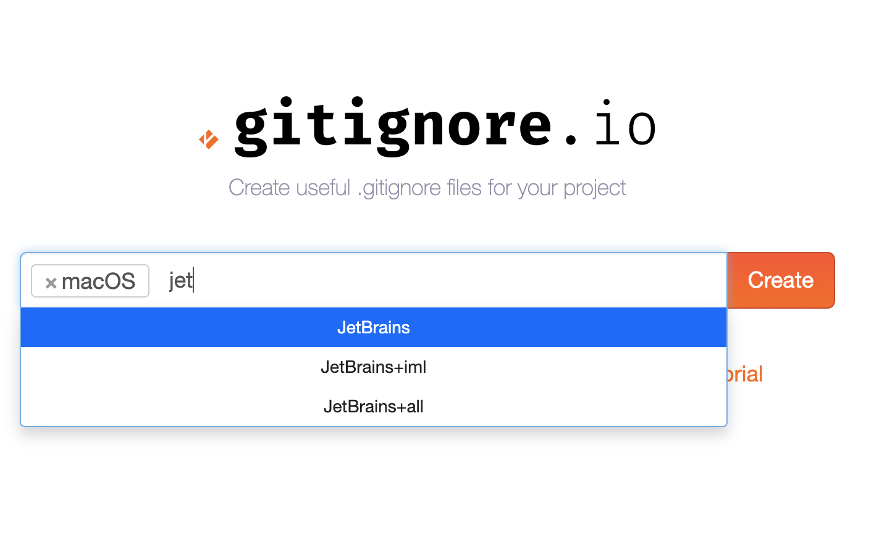
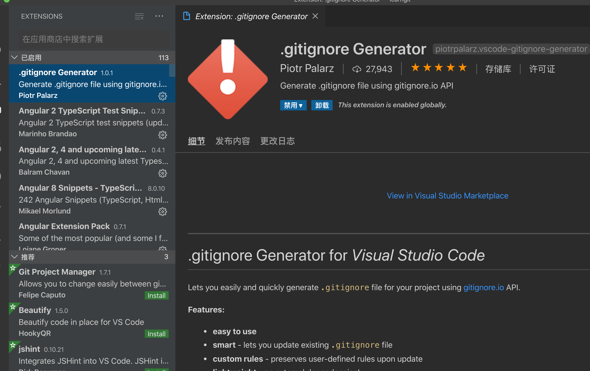
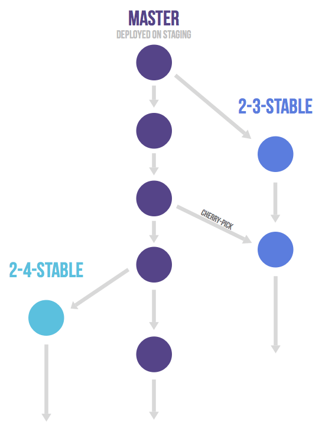
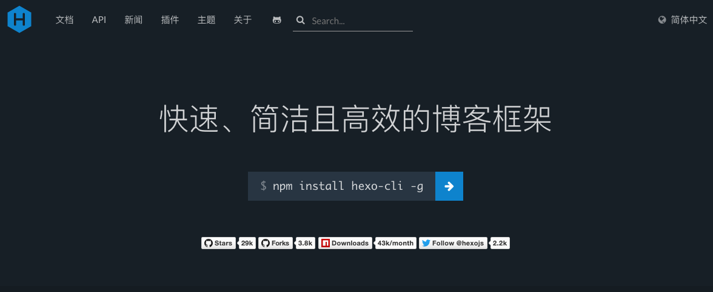
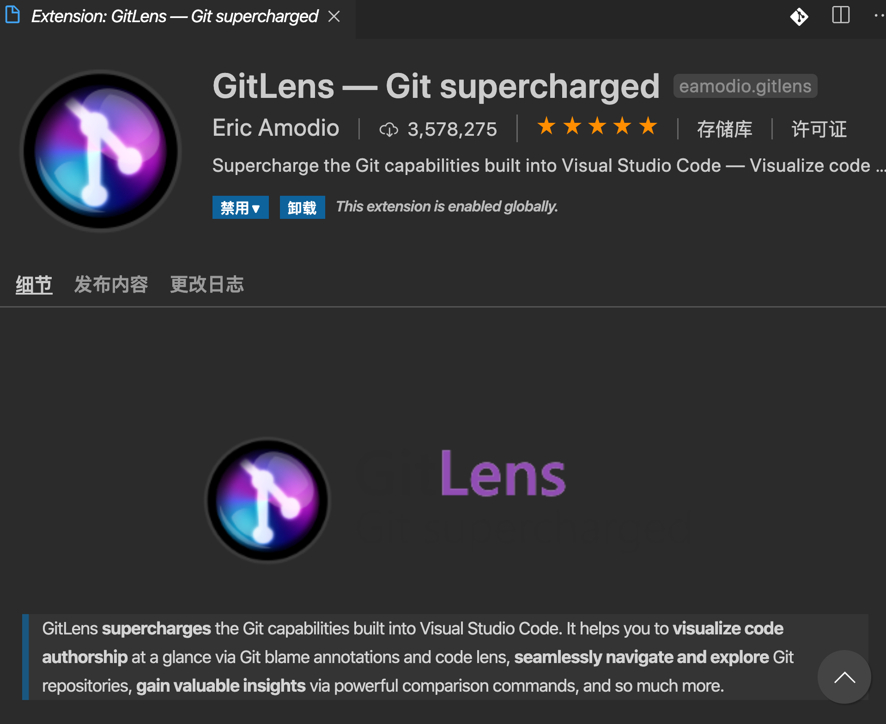
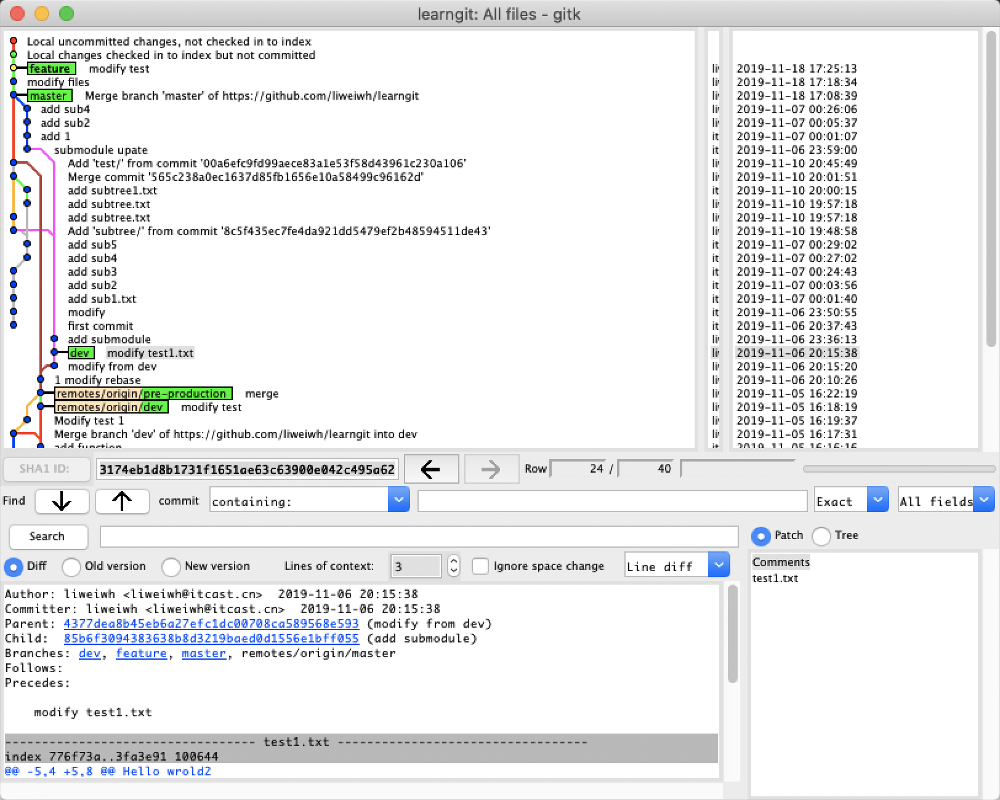

# 版本控制

## 课程介绍

我们在开发中可能会有下面的需求，亟待解决，而这正是版本控制所做的事

- 回到过去
- 改变历史
- 古今对比
- 并行开发
- 谁动了我的代码


许多人习惯用复制整个项目目录的方式来保存不同的版本，或许还会改名加上备份时间以示区别。这么做唯一的好处就是简单。不过坏处也不少：有时候会混淆所在的工作目录，一旦弄错文件丢了数据就没法撤销恢复。


**什么是版本控制？**

你可以把一个版本控制系统（缩写VCS）理解为一个“数据库”，在需要的时候，它可以帮你完整地保存一个项目的快照。当你需要查看一个之前的快照（称之为“版本”）时，版本控制系统可以显示出当前版本与上一个版本之间的所有改动的细节。


**版本控制的重要意义？**


**本课程的主要内容：**

- Git常见命令

- **Git Flow** - Git团队协作的工作流程

- Git团队协作相关的命令

- Git分支概念、分支管理

- Git进阶用法 - Git rebase / submodule / subtree

- Github/Gitee配置SSH密钥，项目管理

- 搭建Gitlab，组建自己的Git仓库

- Git GUI工具的介绍

  

**本课程的学习路径：**

- 熟悉Git
- 熟悉Github/Gitee等Git平台的操作
- 学会基础的Git命令的使用
- 重点熟悉Gitflow的概念
- 学习团队Git协同的方法，掌握相关的Git命令
- 了解Git的进阶用法
- 熟悉GIT相关的GUI工具，包括IDE、gitk、sourceTree


**本课程的学习目标：**

- 掌握Git的基本命令
- 熟练的使用各种git平台
- 熟练使用GUI工具去操作Git仓库
- 熟悉Git flow，并且能够在代码项目中使用，提高开发效率
- 搭建团队的Git平台，并且了解如何进行维护


**本课程的学习准备：**

- Github/Gitee账号
- Linux服务器，或者虚拟机（Centos 7.x）
- 安装Docker服务，参见：https://www.daocloud.io/mirror，或者使用window desktop/mac descktop，参见：https://www.docker.com/products/docker-desktop


## Git vs SVN

**客户端-服务器式**


典型的例子：SVN

在无法连接服务器的情况下，无法查看日志以及提交和比较代码版本（慢速网络和远程异地工作的程序员的痛），以及当服务或者网络出现问题的时候很多人员就会无法工作。

不支持local branch，导致branch创建管理复杂，并且一旦创建就很难修改（快速迭代开发中的程序员的痛）

由于只有一个中心端服务器，一旦发生灾难性问题，那么所有日志都会丢失，所以需要经常做备份（备份需要不小的成本）

如果软件代码量过于庞大，一般会出现速度缓慢的情况，因为每次的日志查询、不同版本之间的代码比较和代码提交等操作都需要和服务器通信，造成服务器端的负载过大。


**分布式：**


分布式管理，在没有和服务器有连接的情况下仍然可以查看日志，提交代码，创建分支；支持local branch，可以快速方便的实现各种分支管理；支持分布式，从而可以实现分块管理，以及负载分流管理。

缺点是有一定的学习曲线，比如分布方式下的代码同步，local branch的理解与运用，分布式代码管理的理解与运用等。


## Git核心概念

### Git工作区域


在这个图中，我们可以看到部分 Git 命令是如何影响工作区和暂存区（stage, index）的：

- 图中左侧为工作区，右侧为版本库。在版本库中标记为 "index" 的区域是暂存区（stage, index），标记为 "master" 的是 master 分支所代表的目录树。
- 图中我们可以看出此时 "HEAD" 实际是指向 master 分支的一个“游标”。所以图示的命令中出现 HEAD 的地方可以用 master 来替换。
- 图中的 objects 标识的区域为 Git 的对象库，实际位于 ".git/objects" 目录下。
- 当对工作区修改（或新增）的文件执行 "git add" 命令时，暂存区的目录树被更新，同时工作区修改（或新增）的文件内容被写入到对象库中的一个新的对象中，而该对象的ID 被记录在暂存区的文件索引中。
- 当执行提交操作（`git commit`）时，暂存区的目录树写到版本库（对象库）中，master 分支会做相应的更新。即 master 指向的目录树就是提交时暂存区的目录树。
- 当执行 "`git reset HEAD`" 命令时，暂存区的目录树会被重写，被 master 分支指向的目录树所替换，但是工作区不受影响。
- 当执行 "`git rm --cached <file>`" 命令时，会直接从暂存区删除文件，工作区则不做出改变。
- 当执行 "`git checkout` ." 或者 "`git checkout -- <file>`" 命令时，会用暂存区全部或指定的文件替换工作区的文件。这个操作很危险，会清除工作区中未添加到暂存区的改动。
- 当执行 "`git checkout HEAD` ." 或者 "`git checkout HEAD <file>`" 命令时，会用 HEAD 指向的 master 分支中的全部或者部分文件替换暂存区和以及工作区中的文件。这个命令也是极具危险性的，因为不但会清除工作区中未提交的改动，也会清除暂存区中未提交的改动。


### Git的常见命令

#### 提交相关

把所有的文件更改提交到暂存区：

```
$ git add -a
```

为所有暂存区的代码写入日志并提交到本地仓库：

```
$ git commit -m "(something)"
```

把所有本地仓库的提交，更新到远程仓库：

```
$ git push
```


#### 缓存工作区文件

使用stash命令可以缓存当前工作区，还不需要提交到远程仓库的文件：

```
git stash
```

使用`--help`来查看对应的命令的帮助：

```
NAME
       git-stash - Stash the changes in a dirty working directory away

SYNOPSIS
       git stash list [<options>]
       git stash show [<stash>]
       git stash drop [-q|--quiet] [<stash>]
       git stash ( pop | apply ) [--index] [-q|--quiet] [<stash>]
       git stash branch <branchname> [<stash>]
       git stash [push [-p|--patch] [-k|--[no-]keep-index] [-q|--quiet]
                    [-u|--include-untracked] [-a|--all] [-m|--message <message>]
                    [--] [<pathspec>...]]
       git stash clear
       git stash create [<message>]
       git stash store [-m|--message <message>] [-q|--quiet] <commit>
```


使用`pop`或者`apply`命令来提取最新的一次缓存的文件变化到工作区：

```bash
# 后进先出的原则，删除stash最新的一次内容，并且把变更设置到工作区
git stash pop

# or 指定stash编号进行恢复
git stash apply {stash}
```


使用`drop`或者`clear`(慎用)去删除stash

```bash
learngit on  master [⇡$!]
➜ git stash drop 1
Dropped refs/stash@{1} (a886052384293e934bffcf86b806882b8d860bac)

learngit on  master [⇡$!]
➜ git stash list
stash@{0}: WIP on master: 70ec556 add new feature

learngit on  master [⇡$!]
➜ git stash clear

learngit on  master [⇡!]
➜ git stash list
```


#### gitignore文件

- 使用[gitignore.io](https://gitignore.io/)去创建

  

- 使用vscode的插件去创建

  


#### Git reset命令(慎用)

`git log`命令：查看每次修改的日志文件。

[git log与git reflog的区别](http://stackoverflow.com/questions/17857723/whats-the-difference-between-git-reflog-and-log)，记得几点：git log是顺着当前分支往前去查找提交记录，而git reflog并不像git log去遍历提交历史，它都不是仓库的一部分，它不包含推送、更新或者克隆，而是作为本地提交记录的清单。简单理解：**本地后悔药**。


`git reset`命令：回退命令。

首先，Git必须知道当前版本是哪个版本，在Git中，用`HEAD`表示当前版本，上一个版本就是`HEAD^`，上上一个版本就是`HEAD^^`，当然往上100个版本写100个`^`比较容易数不过来，所以写成`HEAD~100`。

```
$ git reset --hard HEAD^
HEAD is now at 233a3dd add distributed
```

回退add命令提交到缓存区的文件，并不会把文件恢复缓存区，需要区别`git checkout`命令：

```
$ git reset HEAD <file>
```


#### Git的分支管理

**创建`dev`分支**

创建分支使用`git branch`命令，命令格式：`git branch [分支别名]`

```
$ git branch dev
```

可以使用`$ git branch`来查看所有本地分支，`$ git branch -a`查看所有分支（包括远程分支）。

使用`git checkout [分支名]`切换到对应的分支，如：

```
$ git checkout dev 
```

此时，`HEAD`头指针会指向dev，如果在`dev`上提交，`dev`指针会往前移，而其他分支不变。（`master`分支及指针不变）

当使用`git checkout master`时，`HEAD`头指针会重新指向`master`，此时再提交，`master`指针会往前移。

这个过程，需要自己亲身的试验才能体会到它们的作用和变化。

```
$gitk
```

使用Git自带的图形界面，可以很好的来管理分支。


**冲突解决**

冲突产生：当两个分支中修改的相同的文件并提交（add->commit），合并(merge)这两个分支的时候，会产生冲突。

如下例：

```
$ git checkout -b feature1
```

1. 在新的`feature1`分支下修改了readme.txt：

   ```
   vi readme.txt
   //修改，添加Creating a new branch is quick AND simple.
   $ git add readme.txt 
   $ git commit -m "AND simple"
   ```

2. 切换到`master`分支：

   ```
   $ git checkout master
   
   vi readme.txt
   //在`master`分支上把readme.txt文件的最后一行改为：Creating a new branch is quick & simple
   $ git add readme.txt 
   $ git commit -m "& simple"
   ```

3. 试图合并`master`与`feature1`：

   $ git merge feature1
   Auto-merging readme.txt
   CONFLICT (content): Merge conflict in readme.txt
   Automatic merge failed; fix conflicts and then commit the result.

   （1）使用：`$ git status`来查看冲突文件：

   ```
   $ git status
   # On branch master
   # Your branch is ahead of 'origin/master' by 2 commits.
   #
   # Unmerged paths:
   #   (use "git add/rm <file>..." as appropriate to mark resolution)
   #
   #       both modified:      readme.txt
   #
   no changes added to commit (use "git add" and/or "git commit -a")
   ```

   （2）直接查看readme.txt文件内容：

   ```
   Git is a distributed version control system.
   Git is free software distributed under the GPL.
   Git has a mutable index called stage.
   Git tracks changes of files.
   <<<<<<< HEAD
   Creating a new branch is quick & simple.
   =======
   Creating a new branch is quick AND simple.
   >>>>>>> feature1
   ```

   Git用`<<<<<<<`，`=======`，`>>>>>>>`标记出不同分支的内容，我们修改如下后保存：

   ```
   Creating a new branch is quick and simple.
   ```

4. 再提交：

   ```
   $ git add readme.txt 
   $ git commit -m "conflict fixed"
   [master 59bc1cb] conflict fixed
   ```

   PS: 用带参数的`git log`也可以看到分支的合并情况：

   ```
   $ git log --graph --pretty=oneline --abbrev-commit
   *   59bc1cb conflict fixed
   |\
   | * 75a857c AND simple
   * | 400b400 & simple
   |/
   * fec145a branch test
   ...
   ```

5. 最后，删除`feature1`分支：

   $ git branch -d feature1
   Deleted branch feature1 (was 75a857c).


### Git Flow

经典模型的问题：

- 分支太多管理不便
- 合并流程太复杂，效率低下

经典模型：


1. 适合于持续集成的Git Flow


2. 适合于多版本控制的场景




### 版本仓库的维护

#### 版本仓库的转移

使用git clone命令去克隆bare内容的仓库内容：

```
git clone --bare git@/github.com:username/project.git
```


使用Mirror命令进行推送

```
cd project.git

git push --mirror git@gitcafe.com:username/newproject.git
```


#### 无用分支的删除

我们知道使用`-D`可以删除本地分支，

那删除远程分支呢？其他很简单：

```
git push origin :<要删除的远程分支>
```


#### 使用tag标签

使用`git tag`命令可以给当前的commit进行标签处理

```
git tag v1.0.0
```

使用`-l`参数查看本地的tags

```
git tag -l
```


如果需要删除标签，可以使用：

```
git tag -d v1.0.0
```

如果需要删除远程的标签，可以使用

```
git push origin --delete v1.0.0
```

#### Git rebase提交变基

git rebase带来的好处

- 不会有很多紊乱的提交
- 完备的功能进行提交
- 清晰的分支节点

缺点：

- 不方便master分支上对应版本进行管理，通常需要结合git tag命令


git rebase的使用方法：

```
NAME
       git-rebase - Reapply commits on top of another base tip

SYNOPSIS
       git rebase [-i | --interactive] [<options>] [--exec <cmd>] [--onto <newbase>]
               [<upstream> [<branch>]]
       git rebase [-i | --interactive] [<options>] [--exec <cmd>] [--onto <newbase>]
               --root [<branch>]
       git rebase --continue | --skip | --abort | --quit | --edit-todo | --show-current-patch
```

比如合并master分支上的两次提交：

```bash
git checkout master

git rebase -i head~2
[分离头指针 00a6efc] 1 modify rebase
 Date: Wed Nov 6 20:10:26 2019 +0800
 1 file changed, 1 insertion(+)
Successfully rebased and updated refs/heads/master.
```


### submodule

常用命令`git submodule add`，`git submodule init`等。

这里有一个例子。假设你在开发一个网站，为之创建Atom源。你不想编写一个自己的Atom生成代码，而是决定使用一个库。你可能不得不像CPAN install或者Ruby gem一样包含来自共享库的代码，或者将代码拷贝到你的项目树中。如果采用包含库的办法，那么不管用什么办法都很难去定制这个库，部署它就更加困难了，因为你必须确保每个客户都拥有那个库。把代码包含到你自己的项目中带来的问题是，当上游被修改时，任何你进行的定制化的修改都很难归并。

Git 通过子模块处理这个问题。子模块允许你将一个 Git 仓库当作另外一个Git仓库的子目录。这允许你克隆另外一个仓库到你的项目中并且保持你的提交相对独立。

**1.git submodule add添加子模块**

命令：

```
git submodule add 仓库地址 路径
```

> 注意：路径不能以 / 结尾（会造成修改不生效）、不能是现有工程已有的目录（不能順利 Clone）；仓库地址是指子模块仓库地址，路径指将子模块放置在当前工程下的路径。

**2.git submodule init初始化，update更新**

当clone一个项目带子模块的项目。 当你接收到这样一个项目，你将得到了包含子项目的目录，但里面没有文件：

命令：

```
#初始化子模块

git submodule init

#当子模块中的代码更新后，更新项目

git submodule update
```

> 子模块中，可以正常的使用`git add`,`git commit`,`git push`等常见的git操作。

**3.删除子模块**

step1:删除config配置

```
git submodule deinit -f docker
```

使用`-f`删除文件，使用`--cached`保留文件。

step2:删除子模块缓存

```
git rm --cached the_submodule
```

step3:删除子模块工作区文件

```
rm -rf the_submodule
```

step4：删除子模块在仓库中的空文件夹

```
rm -rf .git/modules/the_submodule
```


### git subtree

随着项目越来越多，很多项目依赖同一个模板或是配置文件想同一管理，又不想分开维护，所以只能互相引用，或是各自维护，导致了后续的很多麻烦。怎么办呢？


场景一： 很多公司手机端和pc同时开发，引用同一套模板，或者通用的组件库。

场景二：用gulp、webpack来打包，或是用node来开发会有一些通用的配置文件需要统一管理。

1.可以使用`git submodule`方法，来建立一个子模块.

2.使用`git subtree`方法：

可以在`git bash`中使用`git subtree --help`来看官方的说明。

语法：

```
#从提交中，创建本地目录
git subtree add   -P <prefix> <commit>

#从仓库中，创建本地目录
git subtree add   -P <prefix> <repository> <ref>

#更新与推送
git subtree pull  -P <prefix> <repository> <ref>
git subtree push  -P <prefix> <repository> <ref>

#快速拆分目录代码
git subtree split -P <prefix> [OPTIONS] [<commit>]

#与指定提交进行合并
git subtree merge -P <prefix> <commit>
```

合并指定提交中的代码到subtree中来。

如：

```
#使用git subtree add新建了目录lib
git subtree add -P lib <repository> <ref>

#此后lib中的文件发生了多次的改变
#可以使用git subtree merge到某次的提交
git subtree merge -p lib <commit>
```

> 使用`git log`或者`git reflog`来查看提交代码，取前6位数


| 分类/比较        | **submodule**                                                | **subtree**                      | **结果**                           |
| ---------------- | ------------------------------------------------------------ | -------------------------------- | ---------------------------------- |
| 远程仓库空间占用 | submodule只是引用，基本不占用额外空间                        | 子模块copy，会占用较大的额外空间 | submodule占用空间较小，略优        |
| 本地空间占用     | 可根据需要下载                                               | 会下载整个项目                   | 所有模块基本都要下载，二者差异不大 |
| 仓库克隆         | 克降后所有子模块为空，需要注册及更新，同时更新后还需切换分支 | 克隆之后即可使用                 | submodule步骤略多，subtree占优     |
| 更新本地仓库     | 更新后所有子模块后指向最后一次提交，更新后需要重新切回分支，所有子模块只需一条更新语句即可 | 所有子模块需要单独更新           | 各有优劣，相对subtree更好用一些    |
| 提交本地修改     | 只需关心子模块即可，子模块的所有操作与普通git项目相同        | 提交执行命令相对复杂一些         | submodule操作更简单，submodule占优 |


## Git平台的搭建

### gitlab平台的搭建

推荐服务器配置：适用于10人的小团队~~~~

2C 4G，参考官方配置：https://docs.gitlab.com/ee/install/requirements.html


方法一：

```bash
sudo docker run --detach \
  --hostname gitlab.example.com \
  --publish 443:443 --publish 80:80 --publish 22:22 \
  --name gitlab \
  --restart always \
  --volume /srv/gitlab/config:/etc/gitlab:Z \
  --volume /srv/gitlab/logs:/var/log/gitlab:Z \
  --volume /srv/gitlab/data:/var/opt/gitlab:Z \
  gitlab/gitlab-ce:latest
```

方法二：

使用docker-compose命令：

```bash
version: '3'
services:
  web:
    image: 'gitlab/gitlab-ce:latest'
    restart: always
    hostname: 'dev.itcastor.com'
    ports:
      - '10080:80'
      - '10081:443'
      - '10082:22'
    volumes:
      - '/srv/gitlab/config:/etc/gitlab'
      - '/srv/gitlab/logs:/var/log/gitlab'
      - '/srv/gitlab/data:/var/opt/gitlab'
```


还有一种方式：

可以参考项目地址: https://github.com/sameersbn/docker-gitlab


### gitea平台的搭建

gitea平台是一个轻量的git平台，支持[三大操作系统](https://docs.gitea.io/zh-cn/install-from-package/)。


使用Docker方式安装（推荐）

```
docker pull gitea/gitea:latest
```

如果要将git和其它数据持久化，你需要创建一个目录来作为数据存储的地方：

```
sudo mkdir -p /var/lib/gitea
```

然后就可以运行 docker 容器了，这很简单。 当然你需要定义端口数数据目录：

```
docker run -d --name=gitea -p 10022:22 -p 10080:3000 -v /var/lib/gitea:/data gitea/gitea:latest
```

然后 容器已经运行成功，在浏览器中访问 [http://hostname:10080](http://hostname:10080/) 就可以看到界面了。你可以尝试在上面创建项目，clone操作 `git clone ssh://git@hostname:10022/username/repo.git`.

注意：目前端口改为非3000时，需要修改配置文件 `LOCAL_ROOT_URL = http://localhost:3000/`。


## 使用Github写个博客



**安装Hexo:**

```bash
npm install hexo-cli -g

# 初始化
hexo init blog

cd blog

# 安装依赖
npm install

# Or hexo s
hexo server
```


**hexo常用的命令：**

- `init`

```
$ hexo init [folder]
```

新建一个网站。如果没有设置 `folder` ，Hexo 默认在目前的文件夹建立网站。


- `new`

```
$ hexo new [layout] <title>
```

新建一篇文章。如果没有设置 `layout` 的话，默认使用 [_config.yml](https://hexo.io/zh-cn/docs/configuration) 中的 `default_layout` 参数代替。如果标题包含空格的话，请使用引号括起来。

```
$ hexo new "post title with whitespace"
```

| 参数              | 描述                                          |
| :---------------- | :-------------------------------------------- |
| `-p`, `--path`    | 自定义新文章的路径                            |
| `-r`, `--replace` | 如果存在同名文章，将其替换                    |
| `-s`, `--slug`    | 文章的 Slug，作为新文章的文件名和发布后的 URL |

默认情况下，Hexo 会使用文章的标题来决定文章文件的路径。对于独立页面来说，Hexo 会创建一个以标题为名字的目录，并在目录中放置一个 `index.md` 文件。你可以使用 `--path` 参数来覆盖上述行为、自行决定文件的目录：

```
hexo new page --path about/me "About me"
```

以上命令会创建一个 `source/about/me.md` 文件，同时 Front Matter 中的 title 为 `"About me"`

注意！title 是必须指定的！如果你这么做并不能达到你的目的：

```
hexo new page --path about/me
```

此时 Hexo 会创建 `source/_posts/about/me.md`，同时 `me.md` 的 Front Matter 中的 title 为 `"page"`。这是因为在上述命令中，hexo-cli 将 `page` 视为指定文章的标题、并采用默认的 `layout`。


-  `generate`

```
$ hexo generate
```

生成静态文件。

| 选项                  | 描述                                                         |
| :-------------------- | :----------------------------------------------------------- |
| `-d`, `--deploy`      | 文件生成后立即部署网站                                       |
| `-w`, `--watch`       | 监视文件变动                                                 |
| `-b`, `--bail`        | 生成过程中如果发生任何未处理的异常则抛出异常                 |
| `-f`, `--force`       | 强制重新生成文件 Hexo 引入了差分机制，如果 `public` 目录存在，那么 `hexo g` 只会重新生成改动的文件。 使用该参数的效果接近 `hexo clean && hexo generate` |
| `-c`, `--concurrency` | 最大同时生成文件的数量，默认无限制                           |

该命令可以简写为

```
$ hexo g
```


- `publish`

```
$ hexo publish [layout] <filename>
```

发表草稿。

d

- `server`

```
$ hexo server
```

启动服务器。默认情况下，访问网址为： `http://localhost:4000/`。

| 选项             | 描述                           |
| :--------------- | :----------------------------- |
| `-p`, `--port`   | 重设端口                       |
| `-s`, `--static` | 只使用静态文件                 |
| `-l`, `--log`    | 启动日记记录，使用覆盖记录格式 |


- `deploy`

```
$ hexo deploy
```

部署网站。

| 参数               | 描述                     |
| :----------------- | :----------------------- |
| `-g`, `--generate` | 部署之前预先生成静态文件 |

该命令可以简写为：

```
$ hexo d
```


- `render`

```
$ hexo render <file1> [file2] ...
```

渲染文件。

| 参数             | 描述         |
| :--------------- | :----------- |
| `-o`, `--output` | 设置输出路径 |


- `migrate`

```
$ hexo migrate <type>
```

从其他博客系统 [迁移内容](https://hexo.io/zh-cn/docs/migration)。


- `clean`

```
$ hexo clean
```

清除缓存文件 (`db.json`) 和已生成的静态文件 (`public`)。

在某些情况（尤其是更换主题后），如果发现您对站点的更改无论如何也不生效，您可能需要运行该命令。


- `list`

```
$ hexo list <type>
```

列出网站资料。


- `version`

```
$ hexo version
```


**推送到Github Pages两种方式**

- 手动推送

  1. 新建一个 `<你的 GitHub 用户名>.github.io` 仓库

  2. 下载**[hexo-deployer-git](https://github.com/hexojs/hexo-deployer-git)**插件

  3. 配置项目根目录下的`_config.yml`文件

     ```yaml
     # You can use this:
     deploy:
       type: git
       repo: <repository url>
       branch: [branch]
       token: ''
       message: [message]
       name: [git user]
       email: [git email]
       extend_dirs: [extend directory]
       ignore_hidden: false # default is true
       ignore_pattern: regexp  # whatever file that matches the regexp will be ignored when deploying
     ```

  4. 打包Hexo，并发布：

     ```
     hexo g
     
     hexo d
     ```

  5. 即可以在 `https://<你的 GitHub 用户名>.github.io`访问到博客了。

- 使用CI/CD工具

  使用TravisCI进行自动打包发布步骤：

  1. 新建一个 repository。如果你希望你的站点能通过 `<你的 GitHub 用户名>.github.io` 域名访问，你的 repository 应该直接命名为 `<你的 GitHub 用户名>.github.io`。

  2. 将你的 Hexo 站点文件夹推送到 repository 中。默认情况下不应该 `public` 目录将不会被推送到 repository 中，你应该检查 `.gitignore` 文件中是否包含 `public` 一行，如果没有请加上。

  3. 将 [Travis CI](https://github.com/marketplace/travis-ci) 添加到你的 GitHub 账户中。

  4. 前往 GitHub 的 [Applications settings](https://github.com/settings/installations)，配置 Travis CI 权限，使其能够访问你的 repository。

  5. 你应该会被重定向到 Travis CI 的页面。如果没有，请 [手动前往](https://travis-ci.com/)。

  6. 在浏览器新建一个标签页，前往 GitHub [新建 Personal Access Token](https://github.com/settings/tokens)，只勾选 `repo` 的权限并生成一个新的 Token。Token 生成后请复制并保存好。

  7. 回到 Travis CI，前往你的 repository 的设置页面，在 **Environment Variables** 下新建一个环境变量，**Name** 为 `GH_TOKEN`，**Value** 为刚才你在 GitHub 生成的 Token。确保 **DISPLAY VALUE IN BUILD LOG** 保持 **不被勾选** 避免你的 Token 泄漏。点击 **Add** 保存。

  8. 在你的 Hexo 站点文件夹中新建一个 `.travis.yml` 文件：

     ```yaml
     sudo: false
     language: node_js
     node_js:
       - 10 # use nodejs v10 LTS
     cache: npm
     branches:
       only:
         - master # build master branch only
     script:
       - hexo generate # generate static files
     deploy:
       provider: pages
       skip-cleanup: true
       github-token: $GH_TOKEN
       keep-history: true
       on:
         branch: master
       local-dir: public
     ```

  9. 将 `.travis.yml` 推送到 repository 中。Travis CI 应该会自动开始运行，并将生成的文件推送到同一 repository 下的 `gh-pages` 分支下

  10. 在 GitHub 中前往你的 repository 的设置页面，修改 `GitHub Pages` 的部署分支为 `gh-pages`。

  11. 前往 `https://<你的 GitHub 用户名>.github.io` 查看你的站点是否可以访问。这可能需要一些时间。


## Gui工具介绍

- IDE自带：webstorm，vscode插件（Git, Gitlens）

  

- GUI工具：SourceTree

  

- GIt原生工具：gitk

  


## 其他学习资料