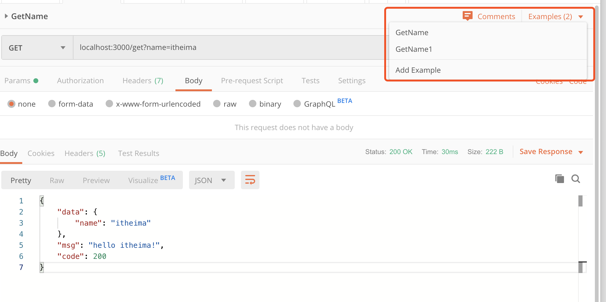

# 接口测试

## 课程介绍

由于我们项目前后端调用主要是基于http协议的接口，所以测试接口时主要是通过工具或代码模拟http请求的发送与接收。


**什么是接口测试?**

接口测试是测试系统组件间接口的一种测试。接口测试主要用于检测外部系统与系统之间以及内部各个子系统之间的交互点。测试的重点是要检查数据的交换，传递和控制管理过程，以及系统间的相互逻辑依赖关系等。


**为什么要做接口测试?**

1. 如今的系统复杂度不断上升，传统的测试方法成本急剧增加且测试效率大幅下降，接口测试可以提供这种情况下的解决方案。

2. 接口测试相对容易实现自动化持续集成，且相对UI自动化也比较稳定，可以减少人工回归测试人力成本与时间，缩短测试周期，支持后端快速发版需求。接口持续集成是为什么能低成本高收益的根源。

3. 现在很多系统前后端架构是分离的，从安全层面来说：

- 只依赖前端进行限制已经完全不能满足系统的安全要求(绕过前面实在太容易)， 需要后端同样进行控制，在这种情况下就需要从接口层面进行验证。

- 前后端传输、日志打印等信息是否加密传输也是需要验证的，特别是涉及到用户的隐私信息，如身份证，银行卡等。


**前端的测试主要内容：**

1. 基本功能测试：

由于是针对基本业务功能进行测试，所以这部分是两种测试重合度最高的一块，开发同学通常所指的也主要是这部分的内容。

2. 边界分析测试：

在基本功能测试的基础上考虑输入输出的边界条件，这部分内容也会有重复的部分(比如业务规则的边界)。但是，前端的输入输出很多时候都是提供固守的值让用户选择(如下拉框)，在这种情况下测试的边界范围就非常有限，但接口测试就不存在这方面的限制，相对来说接口可以覆盖的范围更广，同样的，接口出现问题的概率也更高。

3. 性能测试：

这个比较容易区分，虽然都需要做性能测试，但关注点确大不相同。App端性能主要关注与手机相关的特性，如手机cpu、内存、流量、fps等。而接口性能主要关注接口响应时间、并发、服务端资源的使用情况等。两种测试时的策略和方法都有很大区别，所以这部分内容是需要分开单独进行测试的，理论上来说这也是不同的部分。


综上可以得出：

| \    | 前端测试 | 后台/APP测试           |
| ---- | -------- | ---------------------- |
| 内容 | 业务功能 | 业务功能+边界测试      |
| 偏向 | UI测试   | 逻辑验证               |
| 性能 | 响应     | 本身的性能、服务端资源 |

1. 接口测试和app测试的活动有部分重复的内容，主要集中在业务功能测试方面。除此之外，针对各自特性的测试都不一样，需要分别进行有针对性的测试，才能确保整个产品的质量。

2. 接口测试可以关注于服务器逻辑验证，而UI测试可以关注于页面展示逻辑及界面前端与服务器集成验证


Mock 数据是前端开发过程中必不可少的一环，是分离前后端开发的关键链路。通过预先跟服务器端约定好的接口，模拟请求数据甚至逻辑，能够让前端开发独立自主，不会被服务端的开发所阻塞。


**本课程的主要内容：**

- 接口测试类工具
- mock数据
- 接口代理及调试


**本课程的学习目标：**

- 学习常见的接口测试工具使用方法Postman/Easymock/Yapi/APIDoc/Swagger-UI
- 掌握常见的Mock工具Mockjs/json-server/Faker.js使用方法
- 了解Mock数据的场景及优缺点
- 学习fiddler/charles代理工具的使用


**本课程的学习准备：**

- Linux服务器，或者虚拟机（Centos 7.x）
- p参见：https://www.daocloud.io/mirror，或者使用window desktop/mac descktop，参见：https://www.docker.com/products/docker-desktop


## 接口代理及调试

接口代理工具：Charles-Mac平台，Fiddler-Windows平台

下载地址：

- Charles: https://www.charlesproxy.com/
- Fiddler: https://www.telerik.com/fiddler


### Charles

下载Charles后，打开运行，得到如下页面：


点击顶部右侧的设置菜单：


打开两个常用的设置项，第一个`Proxy Settings`通常我们的Charles会运行Proxy在`8888`端口：


而另外一个常用的设置项为`Access Control Settings`:


用来配置有哪些客户端可以连接过来。


下面当手机连接到运行Charles服务的宿主机上的`8888`端口时，即可以开始调试了。注意：

- 手机与宿主机（运行Charles服务）的设备在同一个网段
- 手机设置wifi中的代理，成为宿主机IP + `8888`端口
- 打开Charles的录制功能，使用filter进行筛选代理的请求


### Fiddler

Fiddler与Charles类似


### 真机调试技巧

#### iOS配合Safari进行真机调试

手机端的设置：

- 设置 --> safari --> 高级 --> 网页检查器 --> 打开
- 然后，Safari访问待测试的页面

Mac端的设置：

- 在safari的设置项中打开“开发”菜单

  

- 使用有线让设备与宿主机电脑相连

- 选择调试

  


#### Android配合Chrome进行真机调试

手机端的设置：

- 开发调试模式（PS: **这里各大Android手机打开调试模式方式不一样，比如小米是连续点击版本号打开，华为也是在系统信息中连续点击版本号后打开**）
- 使用webkit内核的浏览器访问宿主机上待测试的页面

电脑侧的设置：

- 打开Chrome，输入[chrome://inspect/#devices](chrome://inspect/#devices)
- 在下面的Target部分可以看到设备访问的页面，点击`inspect`


出来了熟悉的调试窗口：


#### 使用vConsole第三方插件进行调试

vConsole官方地址：

https://github.com/Tencent/vConsole/blob/dev/README_CN.md


**快速上手**

下载 vConsole 的[最新版本](https://github.com/Tencent/vConsole/releases/latest)。（不要直接下载 dev 分支下的 `dist/vconsole.min.js`），使用方法请参阅[使用教程](https://github.com/Tencent/vConsole/blob/dev/doc/tutorial_CN.md)。

或者使用 npm 安装：

```
npm install vconsole
```

引入 `dist/vconsole.min.js` 到项目中：

```
<script src="path/to/vconsole.min.js"></script>
<script>
  // 初始化
  var vConsole = new VConsole();
  console.log('Hello world');
</script>
```

对于 TypeScript，可引入 d.ts 文件：

```
import 'path/to/vconsole.min.d.ts';
```


**1.下载模块**

下载 vConsole 的[最新版本](https://github.com/WechatFE/vConsole/releases/latest)。

或者使用 `npm` 安装：

```
npm install vconsole
```

然后复制 `dist/vconsole.min.js` 到自己的项目中。


**2.引入模块**

(1) 如果未使用 AMD/CMD 规范，可直接在 HTML 中引入 vConsole 模块。为了便于后续扩展，建议在 `` 中引入：

```
<head>
  <script src="path/to/vconsole.min.js"></script>
  <script>
    var vConsole = new VConsole();
  </script>
</head>
```

(2) 如果使用了 AMD/CMD 规范，可在 module 内使用 `require()` 引入模块：

```
var VConsole = require('path/to/vconsole.min.js');
var vConsole = new VConsole();
```

请注意，`VConsole` 只是 vConsole 的原型，而非一个已实例化的对象。所以在手动 `new` 实例化之前，vConsole 不会被插入到网页中。


vConsole截图：


## 接口测试类工具

### POSTMAN

- postman app [下载地址](https://www.getpostman.com/downloads/)
- postman chrome extensions，需要借助到G歌访问助手等工具下载。


界面：


创建Mock服务器：


Mock数据的文档：https://learning.getpostman.com/docs/postman/mock-servers/mocking-with-examples/

Mock步骤：

1. 设置Examples（Mock数据源）

   

2. 创建Mock server

   创建好之后，可以在Collections中看到`Mocks`选项

   

3. 创建Mock请求

4. 设置Mock参数，发送Mock请求

   使用Mock Url来发送Mock请求：

   


### Easy-Mock平台

#### 搭建平台

使用git命令下载github源码：

```bash
git clone https://github.com/easy-mock/easy-mock.git
```

- 手动安装：

  手动安装需要配置Mongo与redis，都需要安装到localhost本地

  ```bash
  cd easy-mock && npm install
  ```

  运行服务：

  ```bash
  $ npm run dev
  # Visit http://127.0.0.1:7300
  ```

  其他命令：

  ```bash
  # Build front-end assets
  $ npm run build
  
  # Run Easy Mock as production environment (You should run `build` first)
  $ npm run start
  
  # Run unit test
  $ npm run test
  
  # Test lint
  $ npm run lint
  ```

  

- Docker方式快速安装

修改config/default.json文件

```json
{
  "port": 7300,
  "host": "0.0.0.0",
  "pageSize": 30,
  "proxy": false,
  "db": "mongodb://mongo:27017/easy-mock",
  "unsplashClientId": "",
  "redis": {
    "keyPrefix": "[Easy Mock]",
    "port": 6379,
    "host": "redis",
    "password": "",
    "db": 0
  },
  "blackList": {
    "projects": [],
    "ips": []
  },
  "rateLimit": {
    "max": 1000,
    "duration": 1000
  },
  "jwt": {
    "expire": "14 days",
    "secret": "shared-secret"
  },
  "upload": {
    "types": [".jpg", ".jpeg", ".png", ".gif", ".json", ".yml", ".yaml"],
    "size": 5242880,
    "dir": "../public/upload",
    "expire": {
      "types": [".json", ".yml", ".yaml"],
      "day": -1
    }
  },
  "ldap": {
    "server": "",
    "bindDN": "",
    "password": "",
    "filter": {
      "base": "",
      "attributeName": ""
    }
  },
  "fe": {
    "copyright": "",
    "storageNamespace": "easy-mock_",
    "timeout": 25000,
    "publicPath": "/dist/"
  }
}
```

本地构建`Dockerfile`文件

```dockerfile
FROM node:8

WORKDIR /app

COPY . .

RUN npm install --registry=https://registry.npm.taobao.org

EXPOSE 7300

CMD [ "npm", "run", "dev" ]
```

使用`docker build -t server:1.0 .` 进行镜像的构建。


本地docker-compose.yml文件：

```yaml
version: '3.1'
services:
  node:
    image: server:1.0
    restart: always
    ports:
      - 7300:7300
    depends_on:
      - mongo
      - redis

  mongo:
    image: mongo
    restart: always

  redis:
    image: redis
    restart: always
```


#### 平台使用

- 首先可以参考示例项目进行查看支持的Mock数据类型

- 官方的平台上提供了清晰的示例文档

  


Easy Mock 引入了 [Mock.js](http://mockjs.com/)，下面只提供部分语法展示。更详尽的用例及文档请参考 Mock.js 官网。

- 支持生成随机的文本、数字、布尔值、日期、邮箱、链接、图片、颜色等
- 支持扩展更多数据类型，支持自定义函数和正则

比如：

```json
{
  "string|1-10": "★",
  "string2|3": "★★",
  "number|+1": 202,
  "number2|1-100.1-10": 1,
  "boolean|1": true,
  "regexp": /[a-z][A-Z][0-9]/,
  "absolutePath": "@/string @/user/name",
  "user": {
    "name": "demo"
  },
  "object|2": {
    "310000": "上海市",
    "320000": "江苏省"
  },
  "array|1": [ "AMD" ]
}
```

#### 导入Swagger

easymock提供了非常贴心的swagger导入功能：


形成出来的文档与swagger非常类似，同样提供了Mock数据地址：


#### Easymock CLI

官网介绍：https://github.com/easy-mock/easy-mock-cli

安装：

```shell
npm install -g easy-mock-cli
```

使用官方的CLI工具快速形成接口请求的js文件：

创建配置文件：

在你的项目根目录下创建一份名为 `.easymockrc` 的配置文件。

```json
{
  "output": "api",
  "template": "axios",
  "projects": [
    {
      "id": "你要创建的 Easy Mock 项目的 id",
      "name": "demo"
    }
  ]
}
```

以上配置参数的详细介绍在[这里](https://easy-mock.github.io/easy-mock-cli/#/#配置项)可以找到。

生成 API 文件：

在项目根目录下，执行如下命令将自动生成 API 文件。

```bash
easymock init .
```


### Yapi（推荐）

**平台介绍**

[](https://github.com/YMFE/yapi/blob/master/yapi-base-flow.jpg)

YApi 是**高效**、**易用**、**功能强大**的 api 管理平台，旨在为开发、产品、测试人员提供更优雅的接口管理服务。可以帮助开发者轻松创建、发布、维护 API，YApi 还为用户提供了优秀的交互体验，开发人员只需利用平台提供的接口数据写入工具以及简单的点击操作就可以实现接口的管理。


**Yapi的安装与使用：**

github的地址：https://github.com/YMFE/yapi


**安装**

使用我们提供的 yapi-cli 工具，部署 YApi 平台是非常容易的。执行 yapi server 启动可视化部署程序，输入相应的配置和点击开始部署，就能完成整个网站的部署。部署完成之后，可按照提示信息，执行 node/{网站路径/server/app.js} 启动服务器。在浏览器打开指定url, 点击登录输入您刚才设置的管理员邮箱，默认密码为 ymfe.org 登录系统（默认密码可在个人中心修改）。

```bash
npm install -g yapi-cli --registry https://registry.npm.taobao.org
yapi server 
```


**初始化：**


安装完成之后：


使用`node vendors/server/app.js`运行项目。


> Yapi接口Mock测试需要下载Yapi的chrome插件

测试的界面：


### Swagger ui

Swagger使用yaml文件去定义RESTful接口：

```yaml
swagger: "2.0"
info:
  version: "2.0.0"
  title: "swagger test"
host: localhost:3000
basePath: /
schemes:
  - http
consumes:
  - application/json
produces:
  - application/json
paths:
  /get:
    get:
      tags:
        - "test Swagger UI"
      summary: "send get name"
      description: "get request"
      produces:
        - "application/json"
      parameters:
        - name: "name"
          in: "query"
          description: "name of params"
          required: true
          type: "string"
      responses:
        200:
          description: "successful operation"
          schema:
            $ref: "#/definitions/ApiResponse"
definitions:
  ApiResponse:
    type: "object"
    properties:
      code:
        type: "integer"
        format: "int32"
      data:
        type: "object"
      message:
        type: "string"
```

#### Swagger Edit

Swagger Edit是Swagger接口管理的在线编辑器，可以实时去查看yaml对应生成的接口，以及接口测试。


安装依赖

```
npm install -g swagger
```

可以在项目的根目录`/api/swagger/swagger.yaml`去创建接口文件，使用swagger命令来进行编辑 

```
swagger project edit
```


#### Swagger UI

1. 使用gulp去转化yaml的文件到json

   使用全局安装命令来安装`gulp`

   ```
   npm install -g gulp-cli
   ```

   安装依赖

   ```
   npm install -D gulp js-yaml
   ```

   创建`gulpfile.js`

   ```js
   const { watch } = require("gulp");
   const yaml = require("js-yaml");
   const path = require("path");
   const fs = require("fs");
   
   function defaultTask(cb) {
     const doc = yaml.safeLoad(
       fs.readFileSync(path.join(__dirname, "./api/swagger/swagger.yaml"))
     );
     fs.writeFileSync(
       path.join(__dirname, "./public/swagger.json"),
       JSON.stringify(doc, null, "  ")
     );
     cb();
   }
   
   exports.default = function() {
     watch("api/**/*.yaml", defaultTask);
   };
   ```

   使用gulp命令去转化yaml为json数据

2. 使用vscode的live-server去实时的预览

   

3. 使用`koa-static`来进行自己管理

   ```js
   const Koa = require("koa");
   const app = new Koa();
   const Router = require("koa-router");
   const jsonutil = require("koa-json");
   const compose = require("koa-compose");
   const koaBody = require("koa-body");
   const cors = require("@koa/cors");
   const serve = require("koa-static");
   const path = require("path");
   
   // compose 用于压缩中间件
   const middleware = compose([
     koaBody(),
     cors(),
     jsonutil({ pretty: false, param: "pretty" }),
     serve(path.join(__dirname, "../public"))
   ]);
   
   const router = new Router();
   
   // get方法
   router.get("/get", async ctx => {
     const body = ctx.query;
     ctx.body = {
       data: body,
       msg: `hello ${body.name}!`,
       code: 200
     };
   });
   
   // post方法
   router.post("/post", async ctx => {
     const { body } = ctx.request;
     ctx.body = {
       data: body,
       msg: "hello world! Your name is " + body.name,
       code: 200
     };
   });
   
   // delete 方法
   router.delete("/del", async ctx => {
     ctx.body = { errmsg: "ok", errcode: 0 };
   });
   
   // put 方法
   router.put("/put", async ctx => {
     const { body } = ctx.request;
     ctx.body = {
       msg: "hello world! Your name is " + body.name,
       code: 200
     };
   });
   
   app.use(middleware);
   app.use(router.routes());
   
   app.listen(3000);
   ```

   就可以在`localhost:3000`下来访问swagger ui了

### ApiDoc

官网：https://apidocjs.com/

#### 安装与使用

```
npm install -g apidoc
```

创建`demo.js`

```js
/**
 * @api {get} /get Request User information
 * @apiName GetUser Hello APIDoc
 * @apiGroup User
 * @apiVersion 0.2.0
 */
```

就可以使用`apidoc`快速形成文档了。

#### 进阶使用

1. 接口的进阶定义：

   参数地址：https://apidocjs.com/#params

   ```js
   /**
    * @api {get} /get Request User information
    * @apiName GetUser Hello APIDoc
    * @apiGroup User
    * @apiVersion 0.2.0
    *
    * @apiParam {String} name User's name.
    *
    * @apiSuccess {Object} data data from server.
    * @apiSuccess {Number} code  status of server.
    * @apiSuccess {String} msg  status of server.
    *
    * @apiSuccessExample {json} Success-Response:
    *
    * HTTP/1.1 200 OK
    * {
    *   "firstname": "itheima",
    *   "lastname": "Very Good"
    * }
    *
    * @apiErrorExample {json} Error-Response:
    *
    * HTTP/1.1 500 OK
    * {
    *   "code": 500,
    *   "error": "Server error"
    * }
    */
   ```

2. apidoc的配置文件`apidoc.json`

   ```json
   {
     "name": "apidoc-example",
     "version": "0.1.0",
     "description": "apidoc example project",
     "title": "Custom apiDoc browser title",
     "url": "https://api.example.com",
     "sampleUrl": "http://127.0.0.1:3000"
   }
   ```

3. 历史接口的变更对比，在apidoc的根目录下创建`_apidoc.json`即可：

   ```js
   // 保留接口的历史数据的
   
   /**
    * @api {get} /get Request User information
    * @apiName GetUser Hello APIDoc
    * @apiGroup User
    * @apiVersion 0.1.0
    *
    * @apiParam {String} name User's name.
    *
    * @apiSuccess {Object} data data from server.
    * @apiSuccess {Number} code  status of server.
    * @apiSuccess {String} msg  status of server.
    *
    * @apiSuccessExample {json} Success-Response:
    *
    * HTTP/1.1 200 OK
    * {
    *   "firstname": "John",
    *   "lastname": "Doe"
    * }
    *
    * @apiErrorExample {json} Error-Response:
    *
    * HTTP/1.1 500 OK
    * {
    *   "code": 500,
    *   "error": "Server error"
    * }
    */
   ```

   

## Mock数据

### mockjs

#### 安装

第一种：

```js
# 安装
npm install mockjs
```

第二种使用CDN：

```js
https://cdnjs.cloudflare.com/ajax/libs/Mock.js/1.0.0/mock.js
```

直接在Header部分引用即可。


示例：

```js
// 使用 Mock
var Mock = require('mockjs')
var data = Mock.mock({
    // 属性 list 的值是一个数组，其中含有 1 到 10 个元素
    'list|1-10': [{
        // 属性 id 是一个自增数，起始值为 1，每次增 1
        'id|+1': 1
    }]
})
// 输出结果
console.log(JSON.stringify(data, null, 4))
```


#### 语法

1. 数据模板定义规范 DTD

   ```
   # 格式
   
   // 属性名   name
   // 生成规则 rule
   // 属性值   value
   'name|rule': value
   ```

   **注意：**

   - *属性名* 和 *生成规则* 之间用竖线 `|` 分隔。

   - *生成规则* 是可选的。

   - 生成规则

      

     有 7 种格式：

     1. `'name|min-max': value`
     2. `'name|count': value`
     3. `'name|min-max.dmin-dmax': value`
     4. `'name|min-max.dcount': value`
     5. `'name|count.dmin-dmax': value`
     6. `'name|count.dcount': value`
     7. `'name|+step': value`

   - ***生成规则\* 的 含义 需要依赖 \*属性值的类型\* 才能确定。**

   - *属性值* 中可以含有 `@占位符`。

   - *属性值* 还指定了最终值的初始值和类型。

   示例：

   ```js
   const Mock = require("mockjs");
   
   const params = 2;
   const key = "lists|" + params;
   
   const result = Mock.mock({
     code: 200,
     [key]: [
       {
         "number1|1-100.1-10": 1,
         "number2|10.1-10": 1,
         "number3|11.3": 1000,
         "number4|123.10": 1.123,
         "id|+1": 1
       }
     ],
     msg: "mock msg"
   });
   ```

   

2. 数据占位符定义规范

   ```
   # 格式
   
   @占位符
   @占位符(参数 [, 参数])
   ```

   

#### 常规应用

Demo1:

- 在HTML中直接使用script标签引用mockjs
- 在页面中拦截ajax请求

```html
<!DOCTYPE html>
<html lang="en">
  <head>
    <meta charset="UTF-8" />
    <meta name="viewport" content="width=device-width, initial-scale=1.0" />
    <meta http-equiv="X-UA-Compatible" content="ie=edge" />
    <title>Document</title>
    <script src="https://cdn.staticfile.org/Mock.js/1.0.0/mock-min.js"></script>
    <script src="https://cdn.staticfile.org/jquery/3.4.1/jquery.min.js"></script>
  </head>
  <body>
    <div id="app"></div>
    <script>
      Mock.mock(/^\/lists/, "get", {
        code: 200,
        data: {
          "lists|1-10": [
            {
              "id|+1": 0
            }
          ]
        }
      });
      $.ajax({
        url: "/api/lists",
        type: "get",
        dataType: "json",
        success: function(data) {
          if (data.code === 200) {
            var obj = data.data;
            var elem = "";
            $.each(obj.lists, function(item) {
              elem += "<div>" + item + "</div>";
            });
            $("#app").append(elem);
          }
        }
      });
    </script>
  </body>
</html>
```


Demo2:

在Vue工程化项目中进行引用：

`Mock.js`

```js
// 拦截请求
import Mock from "mockjs";

Mock.mock(/\/get/, {
  code: 200,
  "data|10": [
    {
      "id|+1": 1,
      name: "@cname",
      email: "@email",
      picture: "@image('120x120', '#dcdcdc')",
      remark: "@title",
      address: "@city(true)",
      "gender|0-1": 0,
      hobby: "@hobby"
    }
  ]
});

export default Mock;
```


在`Main.js`中进行引用

```js
if (process.env.NODE_ENV !== "production") require("@/mock/index");
```


### Json-server

#### 安装与使用

```shell
npm install -g json-server
```

创建一个`db.json`的文件：

```json
{
  "posts": [
    { "id": 1, "title": "json-server", "author": "typicode" }
  ],
  "comments": [
    { "id": 1, "body": "some comment", "postId": 1 }
  ],
  "profile": { "name": "typicode" }
}
```

然后，使用:

```shell
json-server --watch db.json
```

就可以在`http://localhost:3000/posts/1`获取对应的数据了：

```json
{ "id": 1, "title": "json-server", "author": "typicode" }
```

所有数据的POST, PUT, PATCH,DELETE请求都会得到响应。


#### 动态数据

例如启动json-server的命令：`json-server --watch app.js` 是把一个js文件返回的数据托管成web服务。

`app.js`配合[mockjs](http://mockjs.com/)库可以很方便的进行生成模拟数据。

```js
const Mock = require("mockjs");
const Random = Mock.Random;

const key = "lists|6-10";
// const result = Random.capitalize("hello");
// 自定义占位符
Random.extend({
  hobby: function() {
    var arr = ["swim", "run", "play computer game", "ride"];
    return this.pick(arr);
  }
});

const result = Mock.mock({
  [key]: [
    {
      "id|+1": 1,
      name: "@cname",
      email: "@email",
      picture: "@image('120x120', '#dcdcdc')",
      remark: "@title",
      address: "@city(true)",
      "gender|0-1": 0,
      hobby: "@hobby"
    }
  ]
});

module.exports = () => result;
```

> 当json-server启动之后，mock数据就不会变化了，可以使用nodemon配合着使用，以达到接口随机数据变化的目的。


#### 自定义路由

当然你可以自定义路由：

```sh
$ json-server --routes route.json --watch db.json
```

`route.json`文件

```json
{
  "/api/*": "/$1",
  "/:resource/:id/show": "/:resource/:id",
  "/posts/:category": "/posts?category=:category",
  "/articles\\?id=:id": "/posts/:id"
}
```

对应的请求会进行转发：

```shell
/api/posts # → /posts
/api/posts/1  # → /posts/1
/posts/1/show # → /posts/1
/posts/javascript # → /posts?category=javascript
/articles?id=1 # → /posts/1
```


#### 过滤查询

查询数据，可以额外提供

```
GET /posts?title=json-server&author=typicode
GET /posts?id=1&id=2

# 可以用 . 访问更深层的属性。
GET /comments?author.name=typicode
```

还可以使用一些判断条件作为过滤查询的辅助。

```http
GET /posts?views_gte=10&views_lte=20
```

可以用的拼接条件为：

- `_gte` : 大于等于
- `_lte` : 小于等于
- `_ne` : 不等于
- `_like` : 包含

```http
GET /posts?id_ne=1
GET /posts?id_lte=100
GET /posts?title_like=server
```

**分页查询**

默认后台处理分页参数为： `_page` 第几页， `_limit`一页多少条。

```
GET /posts?_page=7
GET /posts?_page=7&_limit=20
```

> 默认一页10条。

后台会返回总条数，总条数的数据在响应头:`X-Total-Count`中。

**排序**

- 参数： `_sort`设定排序的字段
- 参数： `_order`设定排序的方式（默认升序）

```http
GET /posts?_sort=views&_order=asc
GET /posts/1/comments?_sort=votes&_order=asc
```

支持多个字段排序：

```http
GET /posts?_sort=user,views&_order=desc,asc
```


## 其他学习资料

- 正则表达式30分钟入门：https://deerchao.cn/tutorials/regex/regex.htm
- 在线正则：https://c.runoob.com/front-end/854
- 在线正则1：https://tool.oschina.net/regex