# React Fiber原理解析

React Fiber是React v16.9 中非常重大的更新。

React Fiber的出现导致react架构发生重大变化以及大规模重构，影响最大的就是react的整个生命周期。

以及推动了 Hooks与Suspense的出现。

## react新版本中的一些变化

### 生命周期

新增

- getDerivrdStateFromProps
- getSnapshotBeforeUpdate

删除

- componentWillMount
- componentWillReceiveProps

### Hooks

### Suspense

## 课程目标

- 掌握react核心原理
- 掌握 react v16.9 fiber架构体系
- 掌握fiber架构下的diff算法

## 为什么要学习原理

- 能更好的驾驭react相关的业务
- 对react项目做性能优化更加得心应手
- 增加职业竞争力，从前端工程师中脱颖而出

## 学习步骤

1. 理解react核心概念，从0到1实现一个最简易版react  
2. fiber数据结构
3. 页面渲染全过程

## 学习方法

**整体课程难度偏高，希望同学们耐心再耐心，成功之路没有捷径。**

框架学习大部分是api，可能一看就会。

源码学习的是方法与编程思想，可能一看就不会。

- 勤动手，跟着视频练习
- 遇到不懂的地方
  - 反复看视频
  - 搜索引擎查阅资料

## 第一章 简易版react

### 本章目标

从0到1实现简易react

- 组件挂载  (ReactDom.render)
- 更新  (setState)

> 事件绑定，事务等 暂未实现

### 环境搭建

**工欲善其事，必先利其器。**

`webpack.config.js`

```js
const path = require('path');
const HtmlWebpackPlugin = require('html-webpack-plugin');

module.exports = {
  entry: './src/index.js',
  // devServer: {
  //   // contentBase: path.join(__dirname, 'template'),
  //   index: 'src/template/index.html'
  // },
  module: {
    rules: [
      {
        test: /\.m?js$/,
        exclude: /(node_modules|bower_components)/,
        use: {
          loader: 'babel-loader',
          options: {
            presets: ['@babel/preset-env', '@babel/preset-react']
          }
        }
      }
    ]
  },
  plugins: [
    new HtmlWebpackPlugin({
      // title: '从0到1实现react',
      // // filename: 'adasdasdas.html'
      template: 'src/template/index.html'
    })
  ],
};
```

`package.json`

```json
{
  "name": "react-fiber",
  "version": "1.0.0",
  "description": "## 课程目标",
  "main": "index.js",
  "scripts": {
    "start:dev": "webpack-dev-server --open",
    "test": "echo \"Error: no test specified\" && exit 1"
  },
  "author": "",
  "license": "ISC",
  "devDependencies": {
    "@babel/core": "^7.6.0",
    "@babel/preset-env": "^7.6.0",
    "@babel/preset-react": "^7.0.0",
    "babel-loader": "^8.0.6",
    "html-webpack-plugin": "^3.2.0",
    "webpack": "^4.40.2",
    "webpack-cli": "^3.3.8",
    "webpack-dev-server": "^3.8.0"
  },
  "dependencies": {
    "react": "^16.9.0",
    "react-dom": "^16.9.0"
  }
}


```


### 三个核心概念

- Component
- Element
- Instance

>  这三个核心概念是react**运行的基石**，我们想弄清楚react运行原理，必须先搞清楚它们的区别与联系。

#### Element

**Element** 是一个纯 JavaScript Object。React 正是使用它来描述整个 DOM 树的结构。对于每一个组件来说，render 函数返回的也正是一个 element，而不是真正的 DOM 节点。

```js
{
  type: 'div',
  props: {
    className,
    children,
  }
}
```

**babel在线测试**：https://babeljs.io/repl/

> 面试题： react中的render函数返回值是什么？
>
> render 函数返回的也正是一个 element，而不是真正的 DOM 节点。通过react.createElement来的

#### Component

**Component** 是我们最常写的“组件”，有以下几种类型：

- DOMComponent: `div, span, ul` 等
- CompositeComponent: 复合组件，又分为 functional component 和 class component
- TextComponent: number or string

EX：Clock就一个Component类

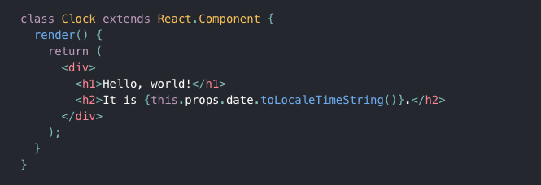

由于我们在使用 React 实现组件化的时候，使用的有且只有 CompositeComponent，所以，我们的每一个组件，其实都是一个 Component。但是当 React 试图去 render 这些组件的时候，**会将 Element 转化成 Component，进而转化成真正的 DOM 节点**。

#### Instance

**Instance** 是 Component 的实例化之后的对象，我们在 Component 中使用的 `this` 就是 instance。这也是 `setState` 和诸多生命周期函数所在的地方。从这一点出发，可以把 Component 理解为 Class，instance是实例化后的结果。

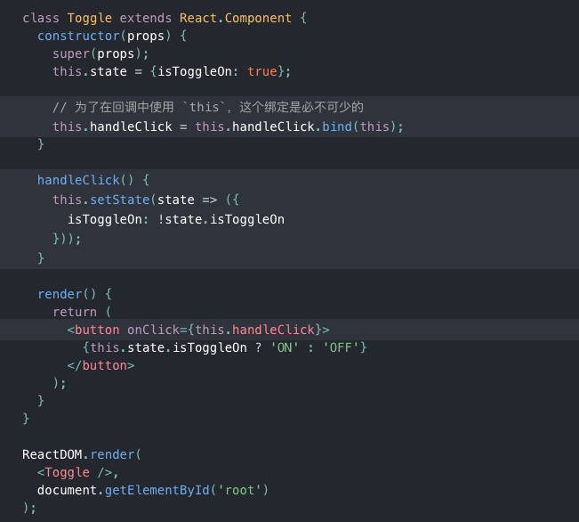

#### createElement实现

如何思考

1. element长什么样？

   type, props, children

2. 接受几个参数

   无数个参数，从第三个开始都是子节点

```js
function createElement(type, config, children) {
    const props = Object.assign({}, config);
    // 判断参数长度
    const childrenLenth = [].slice.call(arguments).length - 2;

    if (childrenLenth > 1) {
        props.children = [].slice.call(arguments, 2);
    } else if (childrenLenth === 1) {
        // 长度 = 1
        props.children = children;
    }

    return {
        type,
        props
    }
}
```

#### render实现

**注意**： 这里的render是ReactDom.render不是componnet中的rendera

```js
function render(element, node) {

    // element 最终会转换成真实的节点
    // 转换过程
    // component componentDidMount  返回一个真实的节点 

    // element => component => componentDidMount

    // 将element生成一个组件类，然后实例化这个组件，调用didMount方法，得到一个真实节点
    // debugger;
    var component = instantiateComponent(element);
    var renderDom = component.mountComponent();

    // var dom = document.createElement('div')
    node.append(renderDom);
}
```

#### instantiateComponent实现

将element变为组件并且实例化。

element的三种类型：

- function
- string
- 原生dom节点

```js
function instantiateComponent(element) {
    var componentInstance;

    if (typeof element.type === 'function') {
        // element.type 本身就是一个复合组件
        componentInstance = new element.type(element.props);  // 得到复合组件的实例
    } else if (typeof element.type ==='string') {
        componentInstance = new DomComponent(element);
    } else if (typeof element === 'string' ||  typeof element === 'number') {
        componentInstance = new DomComponent({
            type: 'span',
            props: {children: element}
        });
    }

    return componentInstance;
}
```

#### DomComponent

核心方法： mountComponent ,返回值为dom

思路： 我们需要在DomComponent这个类中的mountComponent方法得到element演变过来的真实dom。

```js
class DomComponent{
    constructor(element){
        // super();
        this._currentElement = element;
    }

    mountComponent() {
        // :dom
        // 通过 element 去创建dom
        var node = document.createElement(this._currentElement.type);
        
        
        // 需要一个方法去专门处理子节点
        
        return node;
    }
}
```

嵌套标签的渲染：

```js
    _renderDomChildren(props) {  // 递归
        // 获取 子节点信息 
        console.log('_renderDomChildren', props)
        // children
        // 1. string 或者 数字类型 2. 数组
        if (typeof props.children === 'string' || typeof props.children === 'number') {
            var textNode = document.createTextNode(props.children);
            // 如何插入 h1
            this._domNode.appendChild(textNode);
        } else if(props.children) {  // 小技巧
            // 1. 数组 2. 对象  [{type: 'div'}]
            var childrenNodes;   // 转换成真实dom

            if (Array.isArray(props.children)) {  //多个节点
                childrenNodes = props.children.map((el) => {  // element  => dom
                    return new DomComponent(el).mountComponent();
                });// [dom, dom]

            } else {  // 单个节点  element对象 
                childrenNodes = new DomComponent(props.children).mountComponent();
            }

            DOM.appendChildren(this._domNode, childrenNodes);
        }
    }
```

#### Component

实现对复合组件的渲染。

注意： mountComponent这样一个方法是递归实现的。

```js

import instantiateComponent from './instantiateComponent.js';
// 复合组件
class Component {
    constructor() {

    }

    mountComponent() {  // 返回真实dom
        // 依赖于  element  type props children
        // element从 render中来

        var renderElment = this.render();
        // 得到element之后？
         // element 转换为 真实dom
        var renderComponent = instantiateComponent(renderElment);
        var renderNode = renderComponent.mountComponent();

        return renderNode;
    }
}

export default Component;
```

#### Component Update

我们的入口组件就是复合组件，所以我们优先实现它。

思路：

- 获取新旧element
- 对比type，进入第一次diff
  - type相同，进入递归update
  - type不同，直接删除旧的，重新渲染新的组件

```js
    // 1.核心 element
    // 2. 新旧 element
    updateComponent(preElement, nextElement) {
        // 1. nextElement 更新当前的组件 element的引用
        this._currentElement = nextElement;

        this.props = nextElement.porps;
        this.state = this._pendingState;
        this._pendingState = null;

        // 对比 render里面的element   

        // 好好回顾
        var preRenderElement = this._renderComponent._currentElement;
        var nextRenderElement = this.render();

        // diff 算法

        // 1. 如果遇到 element类型不一样，直接删掉旧的， 然后渲染新的
        if (preRenderElement.type === nextRenderElement.type) {
            // 更新逻辑， 需要继续的进行递归，看子节点发生了哪些变化

            // 1.需要调用 updateComponent 方法形成递归
            
            this._renderComponent.updateComponent(this._renderComponent._currentElement, nextRenderElement);

        } else {
            // preRenderElement 对应的真是节点删掉  渲染 nextRenderElement 对象的dom
        }
    }
```

#### Domcomponent Update

思路：

- 如果能走到 DomCompment中的uptade方法，说明标签名一定是一样的
- 从props中拿到新旧的children
- 对children进行遍历对比

```js
    updateComponent(preElement, nextElement) {
        this._currentElement = nextElement;
        
        // 遍历   子节点数组  然后进行前后对比
        this._updateChildren(preElement.props, nextElement.props);
    }

    _updateChildren(prevProps, nextProps) {
        // porps.children 3    字符串,数字 对象， 数组
        var prevType = typeof prevProps.children;
        var nextType = typeof nextProps.children;

        if (nextType === 'undefined') {
            return;
        }

        if (nextType === 'string' || nextType === 'number') {
            // 直接修改真实节点
            this._domNode.textContent = nextProps.children;
        } else {
            // 遍历
        }
    }
```

##### 多个子节点更新

- 单节点
- 多节点

思路： 直接重新渲染

```js
        if (nextType === 'string' || nextType === 'number') {
            // 直接修改真实节点
            // debugger;
            this._domNode.textContent = nextProps.children;
        } else {
            // 遍历
            // debugger;
            DOM.empty(this._domNode)
            if(Array.isArray(nextProps.children)) {
                
                const childrenDoms = nextProps.children.map((childElment) => {
                    return instantiateComponent(childElment).mountComponent();
                });
                DOM.appendChildren(this._domNode, childrenDoms);
            } else {
                const childNode = instantiateComponent(nextProps.children).mountComponent();
                DOM.appendChildren(this._domNode, childNode);
            }
        }
```

### 主流程梳理

对视频中的渲染demo做一个全流程梳理，更深刻理解react渲染机制。

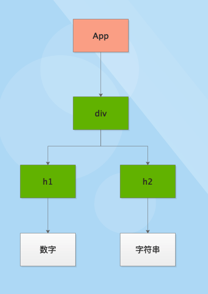

#### 渲染流程

1. render
2. 对element进行实例化
3. 调用mount进行重载
4. Component和DomComponent递归渲染真实节点


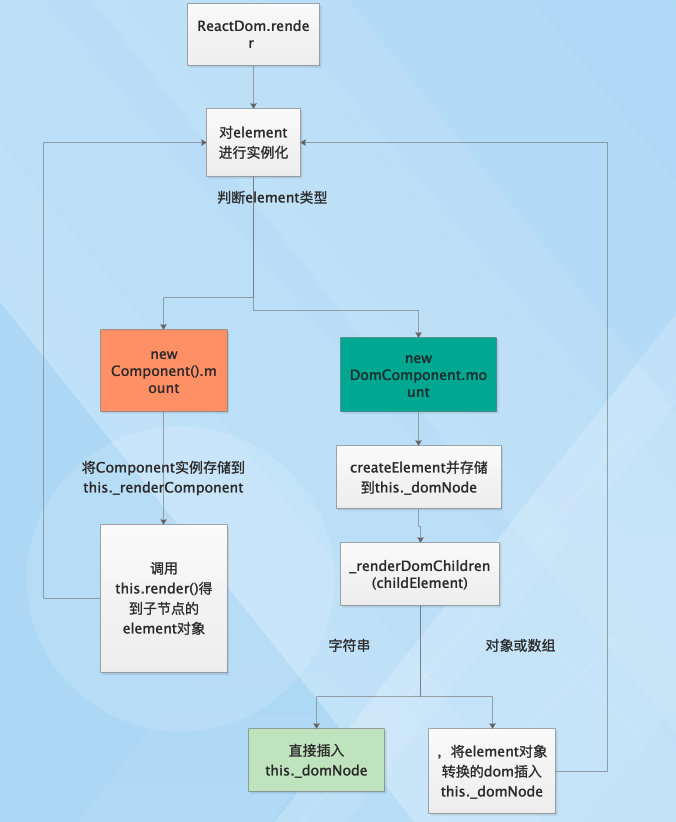

#### 更新流程

1. 在Component中调用setState
2. 调用updateComponent
3. 调用render
4. 进行第一次diff，如果类型不同直接删除，类型相同进入更新
5. Component和DomComponent进行交替递归更新


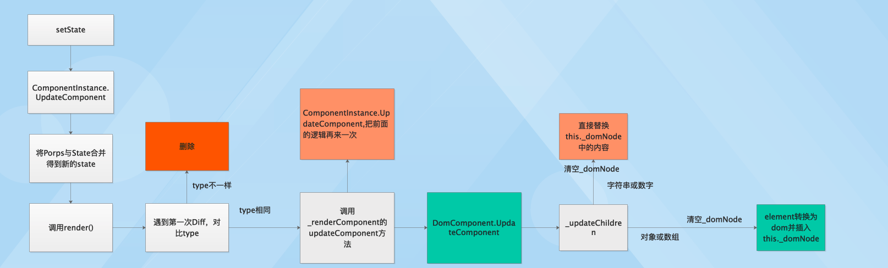


## 第二章 渲染流程优化

### 存在的问题

每次div更新的的时候，都会清空div，然后重新生成h1, 和 h2的真实节点插入div。

这样会造成一定的性能浪费，实际上h1和h2是无需重新生成的，只需要更新内容即可。

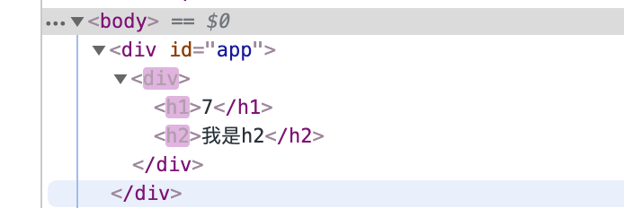


#### 需要优化的代码

```js
    _updateChildren(prevProps, nextProps) {
        // porps.children 3    字符串,数字 对象， 数组
        var prevType = typeof prevProps.children;
        var nextType = typeof nextProps.children;
        // debugger;
        if (nextType === 'undefined') {
            // debugger;
            return;
        }

        // debugger;

        // 清空父亲节点
        DOM.empty(this._domNode);

        if (nextType === 'string' || nextType === 'number') {
            // 直接修改真实节点
            // debugger;
            this._domNode.textContent = nextProps.children;
        } else {
            // 如果 div里面嵌套了其它的节点，而不是数字或者字符串
            
            // 1. this._domNode 中插入更新之后的节点，比如： h1
            // 2. 计算出真实的子节点，通过element对象转换过来
            // 3. 可以从 nextProps.children中得到子节点的element对象
            if (Array.isArray(nextProps.children)) {
                const childElements = nextProps.children;
                const chidNodes = childElements.map((childElement) => {
                    return instantiateComponent(childElement).mountComponent();
                });
                DOM.appendChildren(this._domNode, chidNodes);
            } else {
                // 单个节点
                var childElement = nextProps.children;
                //  实例化， 
                var chidNode = instantiateComponent(childElement).mountComponent();
                DOM.appendChildren(this._domNode, chidNode);
            }
            // ** 需要处理child是数组的情况
        }
    }
```

在else逻辑里面，如果nextProps.children是数组或者对象，我们不能粗暴的清除 _domNode，再调用mountComponent重新生成新的节点插入。

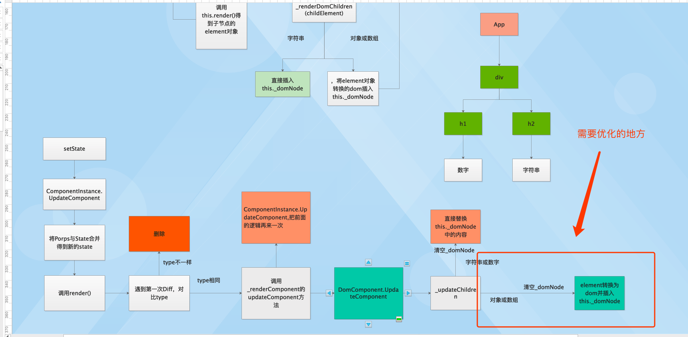

> 不可以在updateComponent中直接调用实例化的 updateComponent方法
>
> 1. 每次update都需要通过element进行实例化，这是不现实的，影响性能。
> 2. 如果直接实例化  只有新的状态，没有旧的，无法对比。

### DomComponent 在 mountComponent阶段的更新

```js
  mountChildren(children) {
    // debugger;
    // children elements => children nodes
    const childrenComponents = ChildReconciler.instantiateChildren(children)
    this._renderedChildren = childrenComponents   // 存储hash map 过的children

    /*
    {
      '.0.0': {_currentElement, ...}
      '.0.1': {_currentElement, ...}
    }
    */

    const childrenNodes = Object.keys(childrenComponents).map((childKey, i) => {
      const childComponent = childrenComponents[childKey]  // 组件实例

      childComponent._mountIndex = i

      return Reconciler.mountComponent(childComponent)
    })

    return childrenNodes
  }
```

### DomComponent 在 Update阶段的更新

```js
updateChildren(nextChildren) {
    // component tree
    let prevRenderedChildren = this._renderedChildren
    // element tree
    let nextRenderedChildren = flattenChildren(nextChildren)
    
    // {
    //   '.0.0': 'element'
    // }


    let mountNodes = []
    let removedNodes = {}
    
    // 进入递归
    ChildReconciler.updateChildren(
      prevRenderedChildren,
      nextRenderedChildren,
      mountNodes,
      removedNodes
    )
  }
}
```


```js
function updateChildren(
  prevChildren, // instance tree
  nextChildren, // element tree
  mountNodes,
  removedNodes
) {
  // hack in the import function
  const instantiateComponent = require('./instantiateComponent')

  // we use the index of the tree to track the updates of the component, like `0.0`
  Object.keys(nextChildren).forEach((childKey) => {
    const prevChildComponent = prevChildren[childKey]
    const prevElement = prevChildComponent && prevChildComponent._currentElement
    const nextElement = nextChildren[childKey]

    if (prevElement && shouldUpdateComponent(prevElement, nextElement)) {
      // 如果 type相同则进入递归
      Reconciler.receiveComponent(prevChildComponent, nextElement)
      nextChildren[childKey] = prevChildComponent
    } else {
      // type不同的情况，省略
    }
  })
```

### Mount流程

递归终止点： 遇到子节点为字符串或者数字

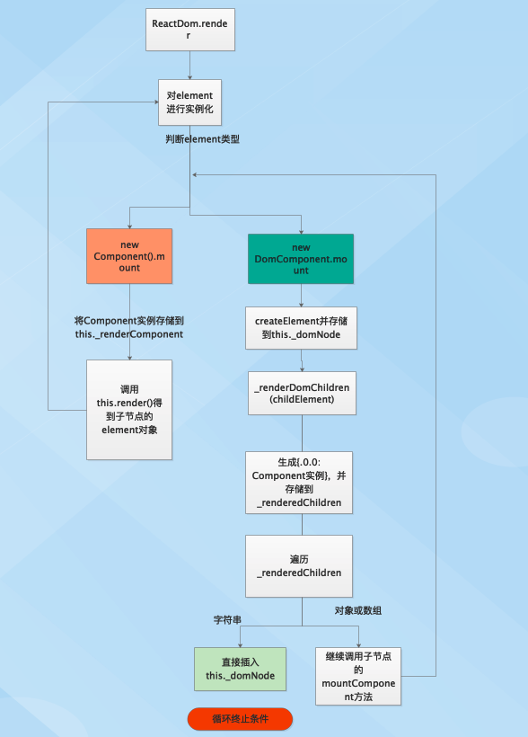

### Update流程

递归终止点： 遇到子节点为字符串或者数字

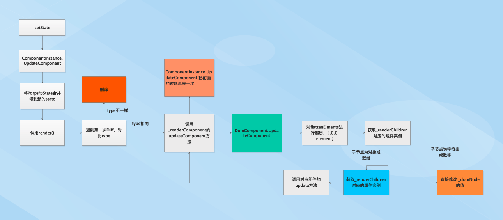


#### 不同type的更新流程

在update的递归阶段收集变化，然后一次性更新

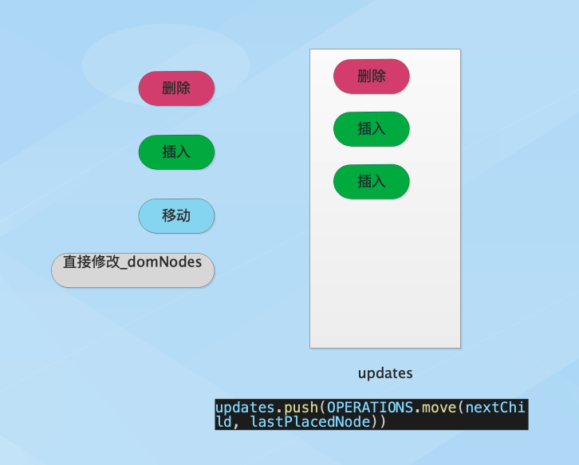

### 总体更新思想

在update的递归阶段收集变化，然后一次性更新

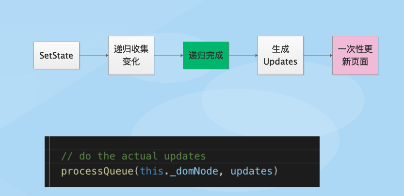


## 第三章 React Fiber

### 章节目标

- 理解Fiber概念与核心设计思想
- 从源码的角度看Fiber数据结构

React16启用了全新的架构，叫做Fiber，其**最大的使命是解决大型React项目的性能问题**，再顺手解决之前的一些痛点。

### React15存在的问题

在页面元素很多，且需要频繁刷新的场景下，React 15 会出现掉帧的现象。请看以下例子;


其根本原因，是大量的同步计算任务阻塞了浏览器的 UI 渲染。默认情况下，JS 运算、页面布局和页面绘制都是运行在浏览器的主线程当中，他们之间是互斥的关系。如果 JS 运算持续占用主线程，页面就没法得到及时的更新。当我们调用`setState`更新页面的时候，React 会遍历应用的所有节点，计算出差异，然后再更新 UI。整个过程是一气呵成，不能被打断的。如果页面元素很多，整个过程占用的时机就可能超过 16 毫秒，就容易出现掉帧的现象。

针对这一问题，React 团队从框架层面对 web 页面的运行机制做了优化，得到很好的效果。


#### 一个小实验

我们可以通过以下实验来窥探React16的优化思想。

```js
function randomHexColor(){
    return "#" + ("0000"+ (Math.random() * 0x1000000 << 0).toString(16)).substr(-6);
}
setTimeout(function() {
    var k = 0;
    var root = document.getElementById("root");
    for(var i = 0; i < 10000; i++){
        k += new Date - 0 ;
        var el = document.createElement("div");
        el.innerHTML = k;
        root.appendChild(el);
        el.style.cssText = `background:${randomHexColor()};height:40px`;
    }
}, 5000);
```

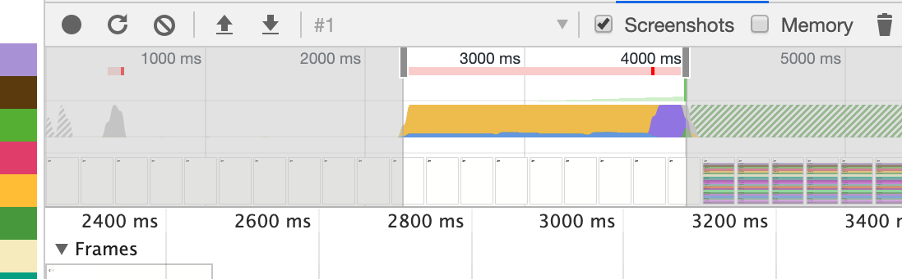

我们再改进一下，分派次插入节点，每次只操作100个节点，共100次，发现性能异常的好！

```js
function randomHexColor() {
    return "#" + ("0000" + (Math.random() * 0x1000000 << 0).toString(16)).substr(-6);
}
var root = document.getElementById("root");
setTimeout(function () {
    function loop(n) {
        var k = 0;
        console.log(n);
        for (var i = 0; i < 100; i++) {
            k += new Date - 0;
            var el = document.createElement("div");
            el.innerHTML = k;
            root.appendChild(el);
            el.style.cssText = `background:${randomHexColor()};height:40px`;
        }
        if (n) {
            setTimeout(function () {
                loop(n - 1);
            }, 40);
        }
    }
    loop(100);
}, 5000);

```

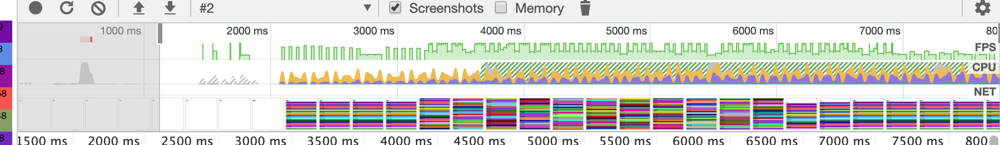

究其原因是因为浏览器是单线程，它将GUI描绘，时间器处理，事件处理，JS执行，远程资源加载统统放在一起。当做某件事，只有将它做完才能做下一件事。如果有足够的时间，**浏览器是会对我们的代码进行编译优化（JIT）及进行热代码优化，一些DOM操作，内部也会对reflow进行处理。**reflow是一个性能黑洞，很可能让页面的大多数元素进行重新布局。

总结一句，**就是让浏览器休息好，浏览器就能跑得更快**。

### 解决问题思路

解决主线程长时间被 JS 运算占用这一问题的基本思路，是将运算切割为多个步骤，分批完成。也就是说在完成一部分任务之后，将控制权交回给浏览器，让浏览器有时间进行页面的渲染。等浏览器忙完之后，再继续之前未完成的任务。


旧版 React 通过递归的方式进行渲染，使用的是 JS 引擎自身的函数调用栈，它会一直执行到栈空为止。而`Fiber`实现了自己的组件调用栈，它以链表的形式遍历组件树，可以灵活的暂停、继续和丢弃执行的任务。实现方式是使用了浏览器的`requestIdleCallback`这一 API。官方的解释是这样的：

> window.requestIdleCallback()会在浏览器空闲时期依次调用函数，这就可以让开发者在主事件循环中执行后台或低优先级的任务，而且不会对像动画和用户交互这些延迟触发但关键的事件产生影响。函数一般会按先进先调用的顺序执行，除非函数在浏览器调用它之前就到了它的超时时间。

### Fiber设计思想

React 框架内部的运作可以分为 3 层：

- Virtual DOM 层，描述页面长什么样。
- Reconciler 层，负责调用组件生命周期方法，进行 Diff 运算等
- Renderer 层，根据不同的平台，渲染出相应的页面，比较常见的是 ReactDOM 和 ReactNative。

这次改动最大的当属 Reconciler 层了，React 团队也给它起了个新的名字，叫`Fiber Reconciler`。这就引入另一个关键词：**Fiber**。

Fiber 其实指的是一种数据结构，它可以用一个纯 JS 对象来表示：

```js
const fiber = {
    stateNode,    // 节点实例
    child,        // 子节点
    sibling,      // 兄弟节点
    return,       // 父节点
}
```

为了加以区分，以前的 Reconciler 被命名为`Stack Reconciler`。Stack Reconciler 运作的过程是不能被打断的，必须一条道走到黑：


而 Fiber Reconciler 每执行一段时间，都会将控制权交回给浏览器，可以分段执行：


为了达到这种效果，就需要有一个调度器 (Scheduler) 来进行任务分配。任务的优先级有六种：

- synchronous，与之前的Stack Reconciler操作一样，同步执行
- task，在next tick之前执行
- animation，下一帧之前执行
- high，在不久的将来立即执行
- low，稍微延迟执行也没关系
- offscreen，下一次render时或scroll时才执行


**优先级高的任务（如键盘输入）可以打断优先级低的任务**（如Diff）的执行，从而更快的生效。

Fiber Reconciler 在执行过程中，会分为 2 个阶段。

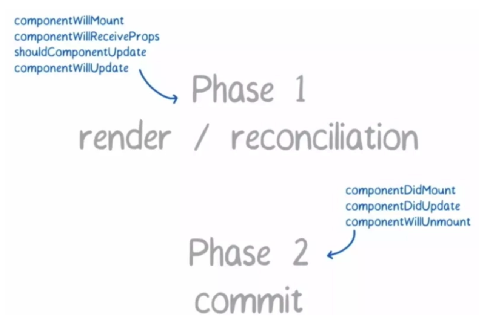

- 阶段一，生成 Fiber 树，得出需要更新的节点信息。这一步是一个渐进的过程，可以被打断。
- 阶段二，将需要更新的节点一次过批量更新，这个过程不能被打断。

阶段一可被打断的特性，让优先级更高的任务先执行，从框架层面大大降低了页面掉帧的概率。

#### 引起生命周期发生变化

https://zh-hans.reactjs.org/docs/react-component.html#mounting

- [`static getDerivedStateFromProps()`](https://zh-hans.reactjs.org/docs/react-component.html#static-getderivedstatefromprops)

- [`getSnapshotBeforeUpdate()`](https://zh-hans.reactjs.org/docs/react-component.html#getsnapshotbeforeupdate)


#### requestIdleCallback

**页面流畅与FPS**

页面是一帧一帧绘制出来的，当每秒绘制的帧数（FPS）达到 60 时，页面是流畅的，小于这个值时，用户会感觉到卡顿。

1s 60帧，所以每一帧分到的时间是 1000/60 ≈ 16 ms。所以我们书写代码时力求不让一帧的工作量不会超过 16ms。

**Frame**

那么浏览器每一帧都需要完成哪些工作？

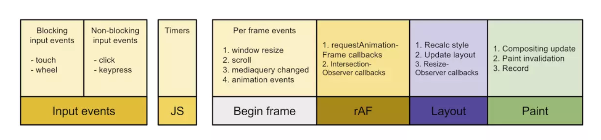

通过上图可看到，一帧内需要完成如下六个步骤的任务：

- 处理用户的交互
- JS 解析执行
- 帧开始。窗口尺寸变更，页面滚去等的处理
- requestAnimationFrame(rAF)
- 布局
- 绘制

**requestIdleCallback**

上面六个步骤完成后没超过 16 ms，说明时间有富余，此时就会执行 `requestIdleCallback` 里注册的任务。

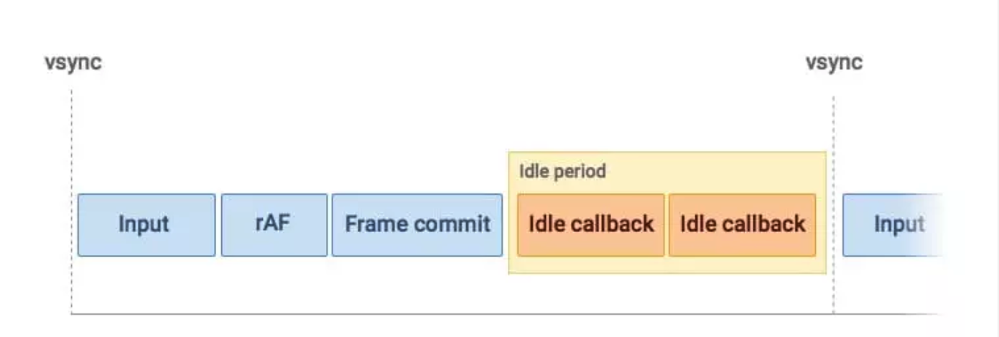

从上图也可看出，和 **requestAnimationFrame 每一帧必定会执行不同，requestIdleCallback 是捡浏览器空闲来执行任务。**

如此一来，假如浏览器一直处于非常忙碌的状态，`requestIdleCallback` 注册的任务有可能永远不会执行。此时可通过设置 `timeout` （见下面 API 介绍）来保证执行。

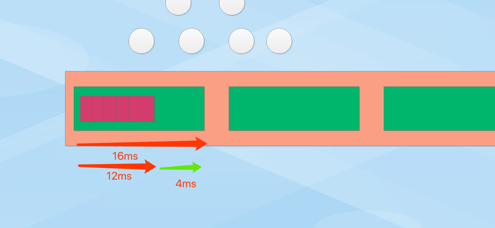

**API**

```jsx
var handle = window.requestIdleCallback(callback[, options])
```

 

- callback：回调，即空闲时需要执行的任务，该回调函数接收一个

  ```
  IdleDeadline
  ```

  对象作为入参。其中

  ```
  IdleDeadline
  ```

  对象包含：

  - `didTimeout`，布尔值，表示任务是否超时，结合 `timeRemaining` 使用。
  - `timeRemaining()`，表示当前帧剩余的时间，也可理解为留给任务的时间还有多少。

- options：目前 options 只有一个参数

  - `timeout`。表示超过这个时间后，如果任务还没执行，则强制执行，不必等待空闲。

```js
requestIdleCallback(myNonEssentialWork, { timeout: 2000 });

// 任务队列
const tasks = [
 () => {
   console.log("第一个任务");
 },
 () => {
   console.log("第二个任务");
 },
 () => {
   console.log("第三个任务");
 },
];

function myNonEssentialWork (deadline) {
 // 如果帧内有富余的时间，或者超时
 while ((deadline.timeRemaining() > 0 || deadline.didTimeout) && tasks.length > 0) {
   work();
 }

 if (tasks.length > 0)
   requestIdleCallback(myNonEssentialWork);
 }

function work () {
 tasks.shift()();
 console.log('执行任务');
}

```

**总结**

一些低优先级的任务可使用 `requestIdleCallback` 等浏览器不忙的时候来执行，同时因为时间有限，它所执行的任务应该尽量是能够量化，细分的微任务（micro task）。

因为它发生在一帧的最后，此时页面布局已经完成，**所以不建议在 requestIdleCallback 里再操作 DOM**，这样会导致页面再次重绘。**DOM 操作建议在 rAF 中进行**。同时，操作 DOM 所需要的耗时是不确定的，因为会导致重新计算布局和视图的绘制，所以这类操作不具备可预测性。

**Promise 也不建议在这里面进行，因为 Promise 的回调属性 Event loop 中优先级较高的一种微任务，会在 requestIdleCallback 结束时立即执行，不管此时是否还有富余的时间，这样有很大可能会让一帧超过 16 ms。**


### 从源码分析fiber数据结构

#### 环境准备

1. 安装 create-react-app

```js
npx create-react-app my-app
cd my-app
npm start
```

2. 安装 react-app-rewired

```js
module.exports = function override(config, env) {
    config.resolve = {
        alias: {
            'react': 'anujs',
            'react-dom': 'anujs',
        }
    };
    return config;
}
```

3. 安装anujs

之所以使用anujs分析react fiber源码，原因是react源码过于复杂，大部分边界内容不需要关注，容易造成学习混淆。

anujs是一个完整实现 fiber 数据结构的类react库，核心思想和react一致，而且代码简洁，高效，是学习源码最好的切入点。

#### 渲染流程

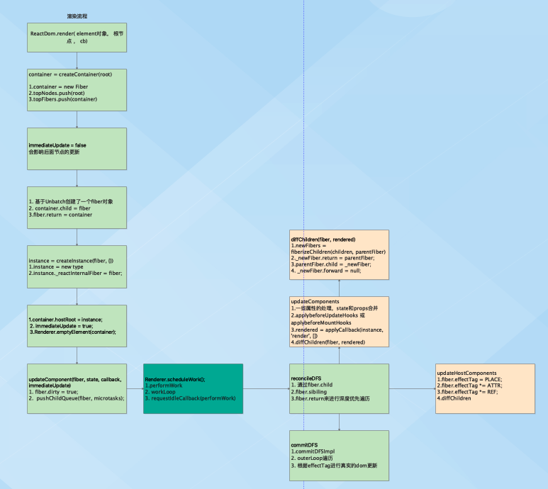

1. render入口

```
ReactDom.render( element对象， 根节点 ， cb)
```

2. 容器创建

```
container = createContainer(root)

1.container = new Fiber
2.topNodes.push(root)
3.topFibers.push(container)

```

3. updateComponent

```
updateComponent(fiber, state, callback, immediateUpdate)
1. fiber.dirty = true;
2.  pushChildQueue(fiber, microtasks);
```

4.scheduleWork进入更新调度阶段

```
Renderer.scheduleWork();
1.performWork
2. workLoop
3. requestIdleCallback(performWork)
```

5. reconcileDFS 深度优先遍历

```
reconcileDFS
1. 通过fiber.child
2.fiber.sibiling
3.fiber.return来进行深度优先遍历
```

6. updateComponents 和 updateHostComponents进行交替遍历更新

```
updateComponents
1.一些属性的处理，state和props合并
2.applybeforeUpdateHooks 或 applybeforeMountHooks
3.rendered = applyCallback(instance, 'render', [])
4.diffChildren(fiber, rendered)
```

```
updateHostComponents
1.fiber.effectTag = PLACE;
2.fiber.effectTag *= ATTR;
3.fiber.effectTag *= REF;
4.diffChildren
```

7. commitDFS提交所有更新进行dom渲染

```
commitDFS
1.commitDFSImpl
2. outerLoop遍历
3. 根据effectTag进行真实的dom更新
```

#### 事件处理

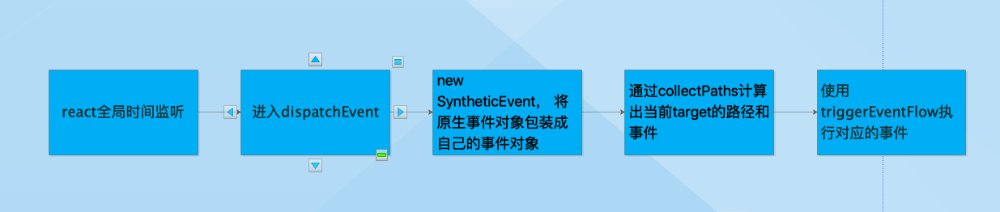

1. react会对浏览器的事件做全局代理，所有的事件都会走到dispatchEvent方法
2. dispatchEvent执行
3. 从 e 中取到原生事件对象，通过SyntheticEvent进行包装
4. 获取真正的target事件以及路径
5. 通过事务的方式执行事件

#### 更新流程

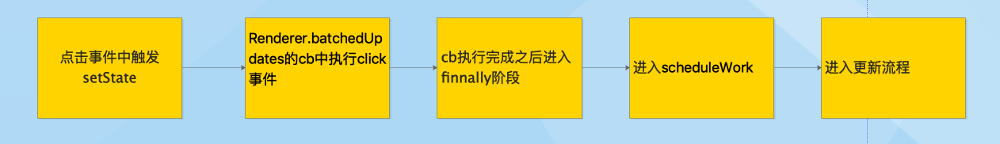

1. 进入setState的点击事件
2. 进入Renderer.batchedUpdates中的回调函数
3. cb执行
4. cb执行之后进入finally逻辑，finally会调用scheduleWork开启下一轮更新
5. 进入更新流程，逻辑和渲染流程一致