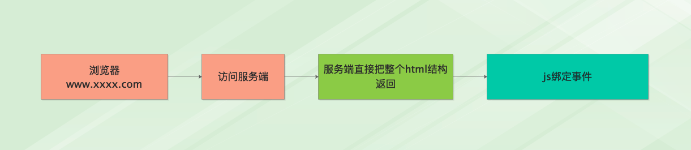
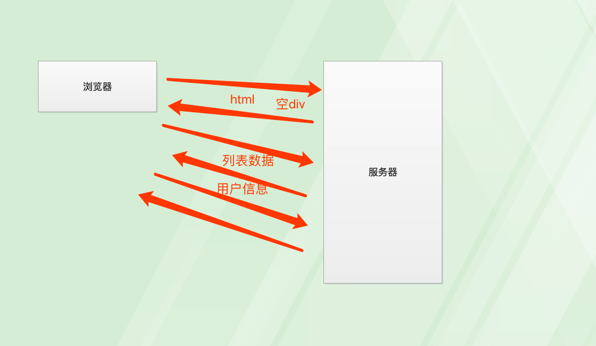
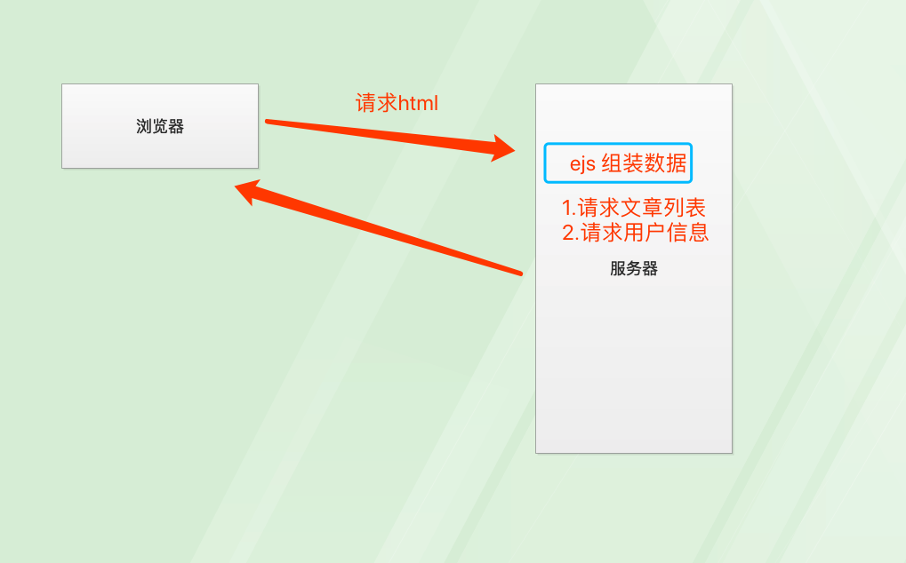
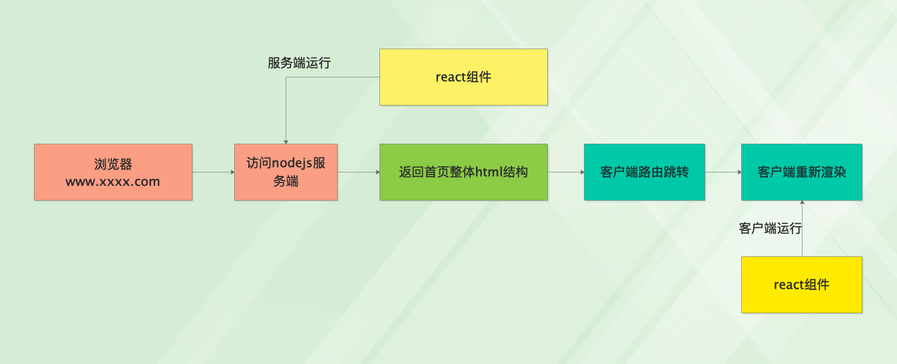
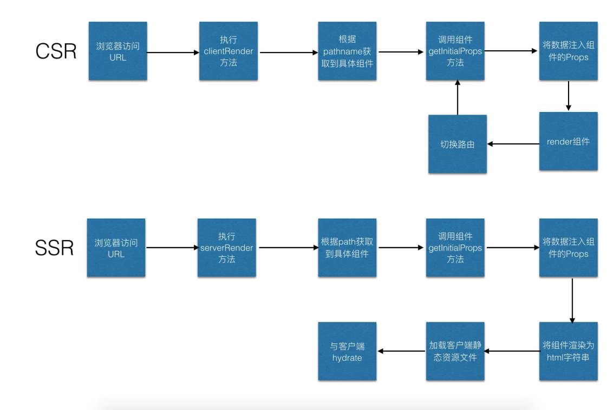

# react服务端同构渲染

## 课程目标

- 理解服务端与非服务端渲染的概念
- 理解什么是同构渲染
- 从0到1搭建一个react服务端渲染环境
- 学习egg-react-ssr服务端同构渲染解决方案
  - Next.js
  - 北斗

## 为什么

- 大势所趋，移动为王
- react 16 对 ssr性能提升非常明显
- 极大提升自身价值

## 第一章 服务端渲染与同构渲染

### 客户端渲染(非服务端渲染)

- 典型的场景SPA，单页面应用


- 优点： 
  - 前后端可以完全分离，前端不依赖后端，沟通协调方便
  - 可以使用react，vue这样的mvvm框架，加快开发速度
- 缺点：
  - 不利于SEO
  - 对于移动端首屏渲染速度有影响
    - 移动端tcp的连接建立非常的昂贵

### 服务端渲染

- 典型的 Java 中的 jsp 模板渲染， nodejs中的ejs模板渲染




**客户端请求html流程：**

- 请求html，返回一个<div id = app></div>
- ajax请求 文章列表数据
- ajax请求用户信息
- js在浏览器本地组装数据(react, vue, jq)
- 插入 <div id = app></div>， 完成渲染

结论： tcp进行了3次连接



**服务端渲染请求html流程：**

- 发起html请求
- 服务端内部通过ejs组装数据
  - 数据库查找文章列表
  - 数据库查找用户信息
  - 组装ejs模板
- 将完整html返回浏览器

结论： tcp只进行了1次连接




- 优点：
  - 对SEO友好
  - 服务端直接返回html结构，对移动端弱网直出页面有帮助
- 缺点：
  - 前后端存在沟通问题，协作不方便
  - 前端有修改，后端不能及时响应

### 同构渲染

- **利用js的跨端特性，让前端react模板能在node服务端运行。结合客户端和服务端渲染2种模式**



- 优点：
  - 前后端不存在沟通问题
  - 能兼顾SEO和移动端性能
  - 可以极大提升自身价值
- 缺点：
  - 上手难度大，对团队实力有要求
    - 前端也需要写服务端nodejs
    - 容易背锅但是也容易出彩
    - 有稳定性要求
  - 高并发情况下对服务端压力较大，需要关注性能问题


## 第二章 从0搭建react服务端同构渲染环境

### 1. 搭建基础webpack react 单页面环境

- 运行react单页面

````js
const dev = process.env.NODE_ENV !== "production";
const path = require( "path" );
const { BundleAnalyzerPlugin } = require( "webpack-bundle-analyzer" );
const FriendlyErrorsWebpackPlugin = require( "friendly-errors-webpack-plugin" );
const MiniCssExtractPlugin = require( "mini-css-extract-plugin" );

const plugins = [
    new FriendlyErrorsWebpackPlugin(),
    new MiniCssExtractPlugin({
        filename: "styles.css",
    }),
];

if ( !dev ) {
    plugins.push( new BundleAnalyzerPlugin( {
        analyzerMode: "static",
        reportFilename: "webpack-report.html",
        openAnalyzer: false,
    } ) );
}

module.exports = {
    mode: dev ? "development" : "production",
    context: path.join( __dirname, "src" ),
    devtool: dev ? "none" : "source-map",
    entry: {
        app: "./client.js",
    },
    resolve: {
        modules: [
            path.resolve( "./src" ),
            "node_modules",
        ],
    },
    module: {
        rules: [
            {
                test: /\.jsx?$/,
                exclude: /(node_modules|bower_components)/,
                loader: "babel-loader",
            }, {
                test: /\.css$/,
                use: [
                    {
                        loader: MiniCssExtractPlugin.loader,
                    },
                    "css-loader",
                ],
            },
        ],
    },
    output: {
        path: path.resolve( __dirname, "dist" ),
        filename: "[name].bundle.js",
    },
    plugins,
};

````

### 2. 创建express http服务

- htttp服务

- 提供服务，编写路由

- 提供正确的html服务（整体），同构， renderToString

```js
// ndoejs服务端
// 1. htttp服务
// 2. 提供服务，编写路由
// 3. 提供正确的html服务（整体），同构，

// 再react服务渲染的情况下，nodejs的代码一定会涉及到es6，所以需要使用babel编译一下
import express from "express";

const app = express();

// 1. 路径 2. 如何处理请求 req， 返回值  res
app.get('/*', (req, res) => {
    res.writeHead(200, { "Content-Type": "text/html" });
    res.end('<h1>hello</h1>');
});

// 创建http服务器
app.listen(2048);

```

### 3.node中运行react代码

- 将react的spa代码移植到nodejs运行

- 打包出css， js

- 在html中引入css  js 以及  jsx转换出来的字符串

- 解决 css 和 js的访问问题

```js
// ndoejs服务端
// 1. htttp服务
// 2. 提供服务，编写路由
// 3. 提供正确的html服务（整体），同构，
// 4. 将react的spa代码移植到nodejs运行

// 再react服务渲染的情况下，nodejs的代码一定会涉及到es6，所以需要使用babel编译一下
import express from "express";
import React from 'react';
import { renderToString } from 'react-dom/server';
// node环境中没有history，所以不能使用 BrowserRouter
// StaticRouter可以用于nodejs环境
import { StaticRouter } from "react-router-dom";
import Layout from "./components/Layout";

const app = express();

const jsx = (
    <StaticRouter>
        <Layout />
    </StaticRouter>
)

// 1. 路径 2. 如何处理请求 req， 返回值  res
app.get('/*', (req, res) => {
    res.writeHead(200, { "Content-Type": "text/html" });
    // 同构， 在服务端将react的element对象转为html字符串
    res.end(renderToString(jsx));
});

// 创建http服务器
app.listen(2048);

```

### 4. 使用html引入css和js

```js
// ndoejs服务端
// 1. htttp服务
// 2. 提供服务，编写路由
// 3. 提供正确的html服务（整体），同构， renderToString
// 4. 将react的spa代码移植到nodejs运行
// 5. 打包出css， js
// 6. 在html中引入css  js 以及  jsx转换出来的字符串
// 7. 解决 css 和 js的访问问题

// 再react服务渲染的情况下，nodejs的代码一定会涉及到es6，所以需要使用babel编译一下
import express from "express";
import React from 'react';
import { renderToString } from 'react-dom/server';
// node环境中没有history，所以不能使用 BrowserRouter
// StaticRouter可以用于nodejs环境
import { StaticRouter } from "react-router-dom";
import Layout from "./components/Layout";
import path from 'path';

const app = express();

const jsx = (
    <StaticRouter>
        <Layout />
    </StaticRouter>
)

// 访问静态资源的插件
app.use( express.static(path.resolve(__dirname, '../dist')) );
// 1. 路径 2. 如何处理请求 req， 返回值  res
app.get('/*', (req, res) => {
    console.log('--------', req.url)
    res.writeHead(200, { "Content-Type": "text/html" });
    // 同构， 在服务端将react的element对象转为html字符串
    const domStr = renderToString(jsx);
    res.end(htmlTemplate(domStr));
});

function htmlTemplate(reactDom) {
    return `
        <!DOCTYPE html>
        <html>
        <head>
            <meta charset="utf-8">
            <title>React SSR</title>
            <link rel="stylesheet" type="text/css" href="./styles.css" />
        </head>
        <body>
            <div id="app">${reactDom}</div>
            <script src="./app.bundle.js"></script>
        </body>
        </html>
    `;
}

// 创建http服务器
app.listen(2048);

```

### 5.使用window传递数据

经过验证发现nodejs运行环境中没有window，所以需要借助redux给组件传递props

```js
function htmlTemplate(reactDom, data) {
    return `
        <!DOCTYPE html>
        <html>
        <head>
            <meta charset="utf-8">
            <title>React SSR</title>
            <link rel="stylesheet" type="text/css" href="./styles.css" />
        </head>
        <body>
            <div id="app">${reactDom}</div>
            <script>
                window.global_data = ${serialize(data)};
            </script>
            <script src="./app.bundle.js"></script>
        </body>
        </html>
    `;
}
```

### 6.引入redux状态管理

-  使用redux给ssr传递数据, 注意： server.js 和 client.js执行的代码永远不会发生关系。

- 访问url的时候，根据对应的组件，nodejs调用fetchData，获得数据后，修改store的状态，

```js
const jsx = (
    <ReduxProvider store={store}>
        <StaticRouter>
            <Layout />
        </StaticRouter>
    </ReduxProvider>
)
```

### 7. redux-thunk的引入

这一段代码非常的经典，值得反复研究！

```js
function createThunkMiddleware(extraArgument) {
  return ({ dispatch, getState }) => (next) => (action) => {
    if (typeof action === 'function') {
      return action(dispatch, getState, extraArgument);
    }

    return next(action);
  };
}

const thunk = createThunkMiddleware();
thunk.withExtraArgument = createThunkMiddleware;

export default thunk;
```

### 8.完善store注入

```js
import { createStore, combineReducers, applyMiddleware } from "redux";
import thunkMiddleware from "redux-thunk";
import fetchDataApi from "./api";

export const initializeSession = () => ({
    type: "INITIALIZE_SESSION",
});

const storeData = (data) => ({
    type: "STORE_DATA",
    data,
});

export const fetchData = () => (dispatch) =>
    fetchDataApi().then(res => dispatch(storeData(res)));

const sessionReducer = (state = false, action) => {
    switch (action.type) {
        case "INITIALIZE_SESSION":
            return true;
        default: return state;
    }
};

const dataReducer = (state = [], action) => {
    switch (action.type) {
        case "STORE_DATA":
            return action.data;
        default: return state;
    }
};

const reducer = combineReducers({
    loggedIn: sessionReducer,
    data: dataReducer,
});

export default (initialState) =>
    createStore(reducer, initialState, applyMiddleware(thunkMiddleware));

```


## 第三章 egg-react-ssr的使用

**最小而美的Egg + React + SSR 服务端渲染应用骨架，同时支持JS和TS**

特点

- 小：实现方式简洁，生产环境构建出来的bundle为同等复杂度的next.js项目的0.4倍，生成文件数量相比于next.js减少非常多
- 全：支持HMR，支持本地开发以及生产环境CSR/SSR两种渲染模式无缝切换，支持定制组件的渲染模式，同时支持TypeScript版本
- 美：基于[React](https://reactjs.org/)和[Eggjs](https://eggjs.org/)框架，拥有强大的插件生态，配置非黑盒，且一切关键位置皆可通过config.default.js来配置

在使用这个项目的公司


### 快速入门

```js
$ npm install yk-cli -g
$ ykcli init <Your Project Name>
$ cd <Your Project Name>
$ npm i
$ npm start
$ open http://localhost:7001
```

### 功能/特性

这个项目骨架的特色是写法简单，功能强大，一切都是组件，支持 SSR/CSR 两种渲染模式无缝切换

### 写法

在写法上统一csr和ssr，采用next类似的静态的getInitialProps作为数据获取方法

```js
function Page(props) {
  return <div> {props.name} </div>
}

Page.getInitialProps = async (ctx) => {
  return Promise.resolve({
    name: 'Egg + React + SSR'
  })
}

export default Page
```

具体说明如下。

- render是React的视图渲染方法
- getInitialProps是获取数据方法，将返回值赋值给组件状态
  - csr通过高阶组件实现
  - ssr通过Node执行

在运行时，通过`npm run csr`和`npm run ssr`来进行区分，是目前最简单的同构渲染方案。当页面初始化加载时，getInitialProps只会加载在服务端。只有当路由跳转（Link组件跳转或 API 方法跳转）时，客户端才会执行getInitialProps。

getInitialProps入参对象的属性如下：

- ctx: Node应用请求的上下文(仅在SSR阶段可以获取)
- Router Props: 包含路由对象属性，包括pathname以及Router params history 等对象，详细信息参考react-router文档

### 一切皆组件

我们的页面基础模版 html，meta 等标签皆使用JSX来生成，避免你去使用繁琐的模版引擎语法

```js
const commonNode = props => (
  // 为了同时兼容ssr/csr请保留此判断，如果你的layout没有内容请使用 props.children ? <div>{ props.children }</div> : ''
  props.children
    ? <div className='normal'><h1 className='title'><Link to='/'>Egg + React + SSR</Link><div className='author'>by ykfe</div></h1>{props.children}</div>
    : ''
)

const Layout = (props) => {
  if (__isBrowser__) {
    return commonNode(props)
  } else {
    const { serverData } = props.layoutData
    const { injectCss, injectScript } = props.layoutData.app.config
    return (
      <html lang='en'>
        <head>
          <meta charSet='utf-8' />
          <meta name='viewport' content='width=device-width, initial-scale=1, shrink-to-fit=no' />
          <meta name='theme-color' content='#000000' />
          <title>React App</title>
          {
            injectCss && injectCss.map(item => <link rel='stylesheet' href={item} key={item} />)
          }
        </head>
        <body>
          <div id='app'>{ commonNode(props) }</div>
          {
            serverData && <script dangerouslySetInnerHTML={{
              __html: `window.__USE_SSR__=true; window.__INITIAL_DATA__ =${serialize(serverData)}`
            }} />
          }
          <div dangerouslySetInnerHTML={{
            __html: injectScript && injectScript.join('')
          }} />
        </body>
      </html>
    )
  }
}
```

### 渲染模式无缝切换

```
在本地开发时，你可以同时启动ssr/csr两种渲染模式查看区别，在生产环境时，你可以通过设置config中的type属性来切换不同的渲染模式，在流量较大时可以降级为csr应用
```

### 执行流程



### 配置

为了足够灵活使用，这里我们将一些关键项提供可配置的选项，可根据实际需要来配置，如无特殊必要，使用默认配置即可。服务端渲染相关配置信息我们放在config.ssr.js，在这里我们建议不要将配置放在egg的配置文件当中，避免前端bundle中包含后端配置文件信息

```js
// config/config.ssr
const resolvePath = (path) => require('path').resolve(process.cwd(), path)

module.exports = {
    type: 'ssr', // 指定运行类型可设置为csr切换为客户端渲染,此时服务端不会做获取数据生成字符串的操作以及不会使用hydrate API
    static: {
        // 设置Node应用的静态资源目录，为了生产环境读取静态资源文件
      prefix: '/',
      dir: resolvePath('dist')
    },
    routes: [
        // 前后端统一使用的路由配置文件，防止重复编写相同的路由
      {
        path: '/', // 请求的path
        exact: true, // 是否精确匹配
        Component: () => (require('@/page/index').default), // 这里使用一个function包裹为了让它延迟require, 否则Node环境无法识别前端组件中用到的import关键字会报错
        controller: 'page', // 需要调用的controller
        handler: 'index' // 需要调用的controller中具体的method
      },
      {
        path: '/news/:id',
        exact: true,
        Component: () => (require('@/page/news').default),
        controller: 'page',
        handler: 'index'
      }
    ],
    injectCss: [
    `/static/css/Page.chunk.css`
  ], // 客户端需要加载的静态样式表
  injectScript: [
    `<script src='/static/js/runtime~Page.js'></script>`,
    `<script src='/static/js/vendor.chunk.js'></script>`,
    `<script src='/static/js/Page.chunk.js'></script>`
  ], // 客户端需要加载的静态资源文件表
  serverJs: resolvePath(`dist/Page.server.js`): string|function // 打包后的server端的bundle文件路径, 接受直接传入require后的function
}

```

### 目录结构

目录结构保持了Egg的方式，以app和config目录为主。将前端React相关代码放到web目录下，webpack打包相关文件位于build目录。整体来看，目录不多，层级不深，属于刚刚好那种。

```js
├── README.md
├── app // egg核心目录
│   ├── controller
│   ├── extend
│   ├── middleware
│   └── router.js // egg路由文件，无特殊需求不需要修改内容
├── app.js // egg 启动入口文件
├── build // webpack配置目录
│   ├── env.js
│   ├── jest
│   ├── paths.js
│   ├── util.js
│   ├── webpack.config.base.js // 通用的webpack配置
│   ├── webpack.config.client.js // webpack客户端打包配置
│   └── webpack.config.server.js // webpack服务端打包配置
├── config // egg 配置文件目录
│   ├── config.daily.js
│   ├── config.default.js
│   ├── config.local.js
│   ├── config.prod.js
│   ├── config.staging.js
│   ├── plugin.js
│   └── plugin.local.js
├── dist // build生成静态资源文件目录
│   ├── Page.server.js // 服务端打包后文件(即打包后的serverRender方法)
│   └── static // 前端打包后静态资源目录
└── web // 前端文件目录
    ├── assets
    │   └── common.less
    ├── entry.js // webpack打包入口文件，分环境导出不同配置
    ├── layout
    │   ├── index.js // 页面布局
    │   └── index.less
    └── page
        ├── index
        └── news

```

### npm scripts

1）启动服务端渲染

启动监听7001端口，只启动服务端渲染，此时仅服务端直出html，没有与客户端混合的步骤

```
$ npm run ssr 
```

2）启动客户端渲染

启动监听8000端口，只启动客户端渲染，相当于传统的cra脚手架开发模式

```
$ npm run csr 
```

3）同时启动csr和ssr方式。

```
$ npm start // 启动监听7001端口，建议使用方式，同时启动服务端渲染 + 客户端hydrate
```

4）配套的脚本

```
$ npm run prod // 模拟SSR应用生产环境
$ npm run build // 打包服务端以及客户端资源文件
$ npm run analyze // 可视化分析客户端打包的资源详情
```